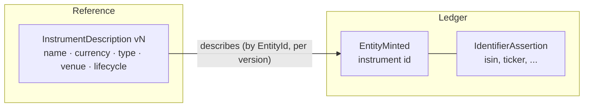

# FDOS Canonical Financial Model

> **Provisional.** This document is a proposal produced by the 2026-08-07
> architectural audit. It is not accepted. Nothing here may be implemented
> against until an RFC and ADR accept the relevant part (per ADR-0000 and
> AGENTS.md). Where this document conflicts with an accepted ADR, the ADR
> governs until superseded.

The canonical model is what Constitution §3 protects: the one financial
language every provider maps into and every rule operates on. This document
inventories what exists, records what must be repaired before real data
depends on it, and completes the model a decade-scale platform needs.

## 1. Kernel value types

### 1.1 Existing — with the repairs that must precede adoption

The audit reproduced every defect below by execution. All are
cheap-now/permanent-later because these encodings end up inside entity IDs and
derivation content addresses in an append-only store.

| Type | Keep? | Must fix before real data |
|---|---|---|
| `Money` | Yes — currency in the type, exact add/sub/mul, no default rounding. | The "exact" context silently rounds half-up at 96 significant digits (traps omit `Inexact`/`Rounded`); fold-order independence is violable at the cliff. One-line fix. |
| `RoundingContext` | Redefine | `precision` is *significant digits*; every real currency rule is *decimal places*. "Round to the cent" is inexpressible, and the wrong parameter is burned into derivation addresses. Add `Quantize(scale, mode)` as the primary primitive; deprecate the significant-digit path. |
| `Quantity` | Yes | Add `Neg`, `Mul`, `Div` — a 2-for-1 split is currently inexpressible without a round-trip through text. |
| `Instant` | Yes — UTC nanosecond | Storage must never compare its textual form: RFC3339Nano trims zeros, so lexicographic ≠ chronological (the measured store defect). The canonical *persisted* form is integer nanoseconds. |
| `Interval` | Yes — half-open `[from,to)` | Delete the degenerate `[at,at]` special case (`IntervalAt`). Add the algebra: `Overlaps`, `Intersect`, `Duration`. |
| `Coordinates` / `AsOf` | Yes, unchanged | The best types in the kernel. No default "now" — preserve at all cost. |
| `EntityId` / `Derive` | Yes | Three seed repairs, shipped together as one "encoding v2": (a) the namespace constant is RFC 4122's *DNS* namespace mislabelled as an FDOS root — replace with a true FDOS namespace; (b) seeds concatenate with unescaped `:` — two distinct claims mint one entity (measured) — length-prefix the components; (c) the generic fold upper-cases case-sensitive schemes (`account_number` "abc123" ≡ "ABC123" — a merge performed, not recorded). |
| `Claim` | Yes | Forbid `:` in schemes, or make the escaping above carry the weight. |
| `Provenance` | Restructure | See §4 — one source + one interpreter cannot represent real acquisition chains. |
| `Confidence` | Yes — ordinal, no arithmetic | `Weakest()` seeded with the *strongest* level launders invalid input upward; empty/zero input must be an error. Separate the `Disputed` *state* from the trust *scale* — "sources disagree" is not a rung below "inferred". |
| `Explained[T]` | Yes — but see §5 | The seed of `Fold` is untraced (two different totals share one address — measured). Seed becomes a traced `Value[T]`: an opening balance is a fact, not a knob. Derivation pre-images need length-prefixed, domain-tagged encoding (measured collisions). |

### 1.2 Additions

| Type | Why the kernel, why now |
|---|---|
| `Date` | A calendar date with no time and no zone. Ex-dates, settlement dates, accrual boundaries are jurisdictional calendar dates; forcing them through `Instant` makes every connector invent a midnight convention, and twenty connectors will invent it twenty ways — permanently, into an append-only ledger. Highest-priority omission. |
| `Rate` | A dimensioned ratio: `Money/Quantity` (price), `Currency/Currency` (FX), `1/Time` (interest). Today `Money × Quantity` ignores units — USD-per-share happily multiplies troy ounces — and an FX rate has no type at all, so it will be modelled three ways in three contexts. Construction requires the dimension; multiplication checks it. |
| `Quantize(scale, mode)` | The rounding primitive every ledger rule actually needs (§1.1). |
| `Allocate(total, ratios)` | Penny-exact distribution of a total across N parts. A different algorithm from rounding a quotient; if the kernel does not offer it, every context solves it differently — the duplication the kernel exists to prevent. |
| Minor-unit primitive | `RoundToMinorUnit(money, table)` — the *table* (JPY 0, USD 2, KWD 3) is reference data and lives outside; the *primitive* consuming it cannot. |

### 1.3 What stays out of the kernel — deliberately

Instruments, accounts, parties as entities (the kernel holds only their
identity kinds); corporate actions; tax-lot and lot-relief policy
(jurisdictional — Analytics); market calendars, day-count conventions, FX
*data* (Reference, consumed by version); any conversion operation (a
calculation carrying a derivation, never a kernel method).

## 2. Entity model

Identity kinds stay a closed set (ADR-0007): `Instrument`, `Party`, `Account`,
`LedgerStream`. Identity is minted, opaque, permanent; external identifiers
are timestamped assertions. All correct — preserve.

What is missing is not identity but **description**. An instrument today is a
UUID that knows nothing — no name, currency, type, venue, or lifecycle. That
description is *reference data*, not kernel data, because it changes over time
(renames, relistings, delistings), varies by publisher, and must be consumed
by version for reproducibility:

The ledger answers *which thing is this*; Reference answers *what is this
thing like, according to publisher P, as of version V*. Collapsing the two —
putting a name on the mint — would freeze a mutable description into an
immutable fact.

## 3. The fact taxonomy

Three kinds (Observation, Occurrence, **Assertion** — the third is proposed in
`Domain-Model.md` §2.2). Target vocabulary; each row is a per-type-versioned
payload behind its own RFC before implementation:

| Fact type | Kind | Effective time means | Payload sketch | Owner |
|---|---|---|---|---|
| `HoldingObserved` | Observation | Interval the stated holding held | account, instrument, quantity *(exists)* | Ledger |
| `BalanceObserved` | Observation | Interval the stated balance held | account, `Money` balance | Ledger |
| `PriceObserved` | Observation | Instant/interval of the quote | instrument, `Rate` (price), venue ref | Market Data |
| `TransactionObserved` | Observation | When the source says it occurred | raw statement line: type-as-stated, amounts, counterparty text | Ledger |
| `StatementObserved` | Observation | Statement period | one per document; the batch parent the per-line facts reference | Ledger |
| `TradeExecuted` | Occurrence | Execution instant | account, instrument, quantity, `Money` gross, fees, venue | Ledger |
| `TradeSettled` | Occurrence | Settlement `Date` | ref to execution, settled amounts | Ledger |
| `TransferredIn` / `TransferredOut` | Occurrence | Transfer effective date | account, instrument, quantity, counterpart account claim | Ledger |
| `DividendDeclared` | Occurrence | Declaration date (carries ex-`Date`, pay-`Date`) | instrument, per-share `Rate`, schedule ref | Corporate Actions |
| `DividendPaid` | Occurrence | Payment date | account, instrument, `Money`, withholding | Corporate Actions |
| `InterestAccrued` | Occurrence (derived) | Accrual interval | instrument, day-count ref, `Money` | Analytics |
| `FeeCharged` | Occurrence | Charge date | account, `Money`, fee classification | Ledger |
| `SplitApplied` | Occurrence (derived) | Ex-date | instrument, ratio, schedule ref | Corporate Actions |
| `MergerApplied` | Occurrence (derived) | Effective date | old/new instrument ids, terms, schedule ref | Corporate Actions |
| `EntityMinted` | **Assertion** | Open interval from mint | *(exists — reclassified)* | Ledger |
| `EntitiesIdentified` | **Assertion** | Interval the identification holds | two ids, evidence refs, ruleset version | Ledger |
| `ClassificationAsserted` | **Assertion** | Interval the classification holds | entity, taxonomy ref, class | Reference/Analytics |

Rules the taxonomy preserves: derived Occurrences (`SplitApplied`,
`InterestAccrued`) are **computations with their own provenance, never
ingestion shortcuts** (ADR-0011); most connector output is Observations, and
converting an Observation to an Occurrence is always an explicit, derivation-
carrying act; CRUD names remain forbidden.

## 4. Provenance: chains, not pairs

`Provenance` today holds one `Source` and one `Interpreter`. A statement PDF
that went OCR → parser → normaliser is three versioned interpreters; only one
can be recorded, so replay pins one stage and silently loses the rest. A fact
synthesised from two acquisitions must nominate one "real" source.

Target: `Provenance` carries an ordered **interpreter chain** (each element
versioned, `unmediated` remaining the honest sentinel for "no code touched
this step") and one-or-more `Source` refs. The wire change is additive
(repeated fields); the constructor keeps refusing emptiness. Batch provenance
stays answered-by-construction (claims from one acquisition share a
`SourceRef`; content addressing makes the repetition free) — but this must be
*proven* against `StatementObserved` before Market Data ships, because
ADR-0010 itself flags per-fact envelope overhead as its open scaling item.

## 5. Explainability as a system, not a signature

`Explained[T]` is currently a return type with zero adopters and no sink:
intermediate derivation records are constructed and dropped, so after three
chained operations the trace's middle does not exist anywhere (measured). The
canonical model is incomplete without the **derivation store**: an
append-only, content-addressed store of `DerivationRecord`s, written by the
combinators, read by `explain(ref)`. Without it, Constitution §8 is true of
compile time and false of the system. Design in `Knowledge-Layer.md`.

## 6. RFC obligations

Requires its own RFC before implementation: (1) encoding v2 — identity
namespace, seed escaping, derivation pre-image, `Fold` seed, shipped as one
coordinated break while zero production data exists; (2) `Date`, `Rate`,
`Quantize`, `Allocate` kernel additions; (3) the Assertion kind (with
`Domain-Model.md` §2.2); (4) each new fact type family above, sequenced by the
roadmap; (5) the provenance chain restructure; (6) the derivation store. Items
(1) is the only one that is urgent rather than sequenced: it is the last
moment these encodings are free to change.
