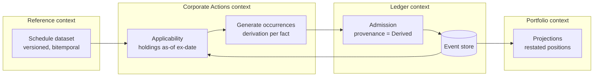

# Corporate Actions — engine design

> **Provisional.** This document is a proposal produced by the 2026-08-07
> architectural audit. It is **not accepted**. Per ADR-0000 and `AGENTS.md`,
> nothing may be implemented against it until an RFC and ADR accept the
> relevant section. Where this document conflicts with an accepted ADR, the
> ADR governs until superseded.

Corporate actions appear in the decision corpus exactly four times, every
occurrence passing — most prominently in ADR-0007, as a *reason* identity is
hard ("an ISIN is reassigned; the entity is the same entity"). The case that
motivated the identity architecture has never been modelled. This document
designs the missing bounded context.

## Position

**Corporate actions are a bounded context that consumes versioned schedules
from the Reference context and emits Occurrence facts with full derivations.
It never mutates history.** A late-arriving or corrected action is new
knowledge: the restated position is the same effective-time question answered
at a later knowledge time. Bitemporality is the restatement mechanism — there
is no other one, and none is needed.

Three consequences of that position:

1. **Schedules are reference data, not facts.** "VALE3 splits 2-for-1,
   ex-date 2026-09-15" arrives as a versioned, bitemporal reference dataset
   (ADR-0010's `ReferenceBinding` finally pinning something that exists).
   The *application* of the action to a holding is what becomes a ledger
   fact.
2. **Applications are Occurrences.** ADR-0011 already names the vocabulary
   (`SharesSplit`, `BondMatured` are its own examples). An applied action is
   something that *happened* — past tense, domain-qualified, with an
   effective time fixed by the market and a knowledge time fixed at append.
3. **The engine is deterministic and explained.** Every generated occurrence
   carries a derivation record naming the schedule dataset version, the
   holdings consumed, the method version, and the rounding context where
   fractional entitlements round. Same ledger + same schedule version + same
   method = same occurrences, byte for byte. This is Constitution §2 and §9
   applied to the first calculation that genuinely needs them.

## Action taxonomy

| Action | Position effect | Identity effect | Cost-basis effect | Cash effect |
|---|---|---|---|---|
| Cash dividend | none | none | none (return of capital variant: reduces basis) | credit at pay date |
| Stock dividend | quantity increases | none | basis reallocated across new quantity | none |
| Split / reverse split | quantity × ratio | none — same entity | basis per share ÷ ratio; total unchanged | fractional-share cash-in-lieu |
| Merger (stock-for-stock) | position in A closes, position in B opens | `EntitiesIdentified` links A's lineage; B is a distinct entity | basis carries over per exchange ratio | cash component if mixed consideration |
| Spinoff | new position in child | new entity minted for child | basis allocated parent/child per stated ratio | none |
| Symbol / identifier change | none | **none** — a new `IdentifierAssertion` on the same entity | none | none |
| Delisting | position marked non-marketable (observation), not deleted | none | none | terminal cash if compulsory acquisition |

Two rows do the most architectural work:

- **Symbol change is not an action on positions.** It is a new identifier
  assertion about an unchanged entity — the exact case ADR-0007's
  birth-certificate seed was designed for. No occurrence is emitted; the
  Reference context records the assertion, and resolution continues to find
  the same `EntityId`.
- **Merger and spinoff are where identity continuity is earned.**
  `EntitiesIdentified` (recorded, weighted `same_as` — ADR-0007) is the
  mechanism; the audit found the flagship projection does not consult it
  (`ProjectPosition` filters by byte-equal instrument ID). **Wiring alias
  traversal into projections is a precondition of this entire context**:
  without it, every merger splits a position into two silently disconnected
  histories — the failure the identity architecture exists to prevent.

## Processing pipeline

Step by step:

1. **Schedule observed.** A connector delivers the provider's schedule as an
   observation into the Reference context (shape-normalised only — meaning
   stays here, per the ecosystem boundary). Reference publishes it as a
   versioned dataset: `corporate-actions/b3@2026-09-01`.
2. **Applicability.** For each scheduled action, the engine asks the
   Portfolio projection: which accounts held the affected instrument —
   *aliases resolved* — as of the ex-date's record boundary? This read is
   as-of both axes: effective at the record date, knowledge at engine run
   time. Look-ahead bias is structurally impossible because the query cannot
   omit either coordinate (ADR-0009).
3. **Generation.** For each affected holding the engine emits the applied
   occurrence(s) — quantity deltas, basis reallocation, cash-in-lieu — each
   carrying `Derived` provenance whose derivation names: the schedule
   dataset and version, every holding fact consumed (by ref), the method and
   version, the rounding context for any division. Fractional entitlements
   are the first real consumer of the kernel's proposed `Quantize` and
   `Allocate` primitives.
4. **Admission.** Generated occurrences enter through the same admission
   path as everything else — the ledger revalidates as though the engine
   were hostile (ADR-0029's rule, kept). The engine holds no append
   privilege beyond any other caller; its authority question is D2's.
5. **Restatement.** Nothing restates. A projection asked at a knowledge time
   after admission sees split-adjusted positions; asked at a knowledge time
   before, it sees the pre-action world — which is exactly what "what did we
   believe on date D" must return to an auditor.

## Why ex-dates require a calendar `Date` type

Everything temporal in the kernel is a UTC-nanosecond `Instant`. An ex-date
is not an instant: it is a **calendar date in a market's jurisdiction**. B3's
2026-09-15 begins at 03:00 UTC; NYSE's at 04:00 or 05:00 UTC depending on
daylight time. Forced through `Instant`, every connector and every engine
independently invents a midnight convention, and a holding acquired at
23:00 São Paulo time on the 14th lands on the wrong side of a UTC-midnight
ex-date — silently, differently per source, permanently once ledgered.

The kernel needs `Date` (calendar date, no time, no zone) before this
context writes its first schedule. Market calendars and session times remain
reference data — the *type* is kernel vocabulary, the *tables* are versioned
datasets. This ordering is deliberate: once twenty connectors have each
picked a convention, the inconsistency is in the ledger and no code change
corrects it.

## Worked example — 2-for-1 split, with a late correction

VALE3 splits 2-for-1, ex-date 2026-09-15. Account holds 100 shares.

| # | Fact | Effective | Knowledge |
|---|---|---|---|
| 1 | `HoldingObserved` 100 sh | 2026-09-01 → open | 2026-09-02T14:00Z |
| 2 | `SharesSplit` ×2 (derived from schedule `b3@2026-09-01`) | 2026-09-15 | 2026-09-15T09:00Z |
| 3 | Schedule corrected: ratio was 3-for-1 (`b3@2026-09-20`) | — (reference data) | 2026-09-20 |
| 4 | `FactCorrected` on #2, replacement `SharesSplit` ×3 | 2026-09-15 | 2026-09-20T11:00Z |

What projections answer:

| Query (effective, knowledge) | Position | Why |
|---|---|---|
| Sep 10, Sep 10 | 100 | pre-split world |
| Sep 16, Sep 16 | 200 | split ×2 known and in force |
| Sep 16, Sep 21 | 300 | correction known; replacement payload substituted |
| Sep 16, Sep 16 *(asked on Sep 21)* | 200 | what we believed then — the audit answer |

Row 4 is why the corrections redesign in `Ledger.md` §4 is a prerequisite:
today a `FactCorrected` carries no replacement payload and projections ignore
it — the ledger would agree the split ratio was wrong and keep answering 200.
Row 4's derivation names both schedule versions, so "why did this number
change between Friday and Monday" is data, not archaeology.

## What the engine never does

- **Never mutates or deletes** — restatement is bitemporal, always.
- **Never corrects a provider's schedule** — a suspect schedule is recorded
  as observed and disputed via confidence/corrections; silently "fixing" it
  destroys the audit trail (the ecosystem boundary's own rule, applied to
  reference data).
- **Never infers a missing schedule** from price behaviour. A halved price
  is not a split; inference is a modelling decision for a far-future
  context, and it would be an `Assertion`-kind fact (ADR-0011's open third
  kind), not an Occurrence.
- **Never mints identity as a side effect.** Spinoff children are minted
  through `Ledger.MintIdentity` (ADR-0033) under whatever authority D2
  eventually names — an engine is not a minting authority.

## What must be decided first, in order

1. **Reference context RFC** — datasets as first-class, versioned, bitemporal
   publications; without it `ReferenceBinding` pins versions of nothing and
   step 1 of the pipeline has no home.
2. **Kernel `Date` RFC** — before any connector ships a schedule convention.
3. **Corrections redesign RFC** (`Ledger.md` §4) — restatement depends on
   replacement-carrying corrections.
4. **Alias traversal in projections** — fix or formally decide against;
   merger continuity is impossible without it.
5. **This context's RFC** — taxonomy, occurrence vocabulary and payload
   schemas, engine method versioning, cash-in-lieu rounding policy.

Sequenced this way, each decision is consumed by the next; none is
speculative when made — the discipline the corpus already practices, aimed at
the domain for the first time.
