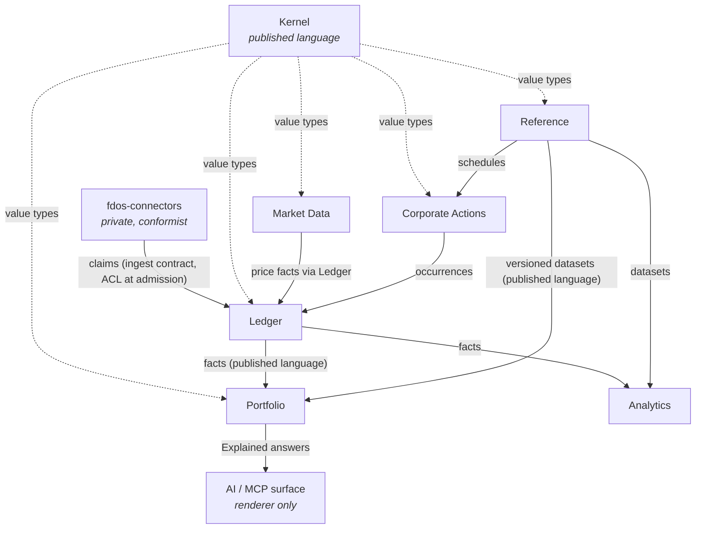

# FDOS Target Domain Model

> **Provisional.** This document is a proposal produced by the 2026-08-07
> architectural audit. It is not accepted. Nothing here may be implemented
> against until an RFC and ADR accept the relevant part (per ADR-0000 and
> AGENTS.md). Where this document conflicts with an accepted ADR, the ADR
> governs until superseded.

## 1. Bounded contexts

Seven contexts. Three exist, one exists in fragments, three are missing. The
map deliberately keeps the count low: a context earns its boundary by owning
language that would be corrupted if shared, not by being a folder.

| Context | Status | Owns |
|---|---|---|
| **Kernel** | exists (`libs/kernel`) | The shared value vocabulary: identity, money, time, provenance, explanation. No entities, no policy, no I/O. |
| **Ledger** | exists (`libs/ledger`, `libs/ledger-sqlite`) | Admission, facts, corrections, minting, the event store. The only place truth is written. |
| **Reference** | missing | Instruments-as-described, calendars, day-count conventions, FX datasets — versioned, bitemporal, published. The thing `ReferenceBinding` points at, which today is nothing. |
| **Portfolio** | missing | Read models: positions, valuation, exposure; snapshots; the query surface. The platform's product. |
| **Market Data** | missing | Price observations at volume; batch admission semantics. |
| **Corporate Actions** | missing | Action schedules (reference-shaped) and the engine that turns them into Occurrences (ledger-shaped). See `Corporate-Actions.md`. |
| **Analytics** | missing, correctly deferred | Deterministic engines beyond projection: cost basis, accrual, performance, risk. Requires the derivation store first. |

Named in ADR-0013 but **cut from this map**: *Credit Intelligence*. It has no
consumer, no data source in either repository, and no definition anywhere. A
context with no language to protect is a folder. Re-propose it when a consumer
exists.

### Context map

Relationship rules:

- **Kernel → everyone** is a published language. No context redefines a kernel
  type, ever (Constitution §3).
- **Connectors → Ledger** is conformist with an anti-corruption layer *at
  admission*: the ledger revalidates everything as though the producer were
  hostile (ADR-0029 §2, carried by ADR-0037). Claims in, nothing else.
- **Ledger → Portfolio** is the published fact language. Portfolio never
  writes facts. There is no reverse edge.
- **Reference → \*** is versioned publication. Consumers pin dataset versions
  via `ReferenceBinding`; they never read "current".
- **Corporate Actions → Ledger** is the one engine permitted to *derive*
  Occurrences, each carrying a derivation naming the schedule version and the
  facts consumed.
- **AI** consumes `Explained` values and renders. It has no write edge to
  anything. This is already structural (`ModelOutput` is unreachable from
  `Fact`) and must remain so.

## 2. Resolved positions

The audit found four modelling questions answered by accident or not at all.
This document takes positions; each needs its own RFC before code changes.

### 2.1 Stream topology: a stream is an aggregate's fact stream, named by minted identity

ADR-0011 decided "stream assignment is structural, derived from the aggregate
the fact concerns, never a routing decision." The shipped wire contract hands
the producer a free-text `stream` field — a routing decision made by an
unauthenticated stranger, unvalidated (the audit measured an empty stream name
accepted and persisted unreadably).

Position:

- A stream is the fact stream of exactly one **Account** aggregate (the only
  aggregate today whose facts have per-stream ordering requirements).
- The stream name is the account's **minted `EntityId`** —
  `identity.KindLedgerStream` already exists for this and is used nowhere.
- A submission carries identifier *claims*; admission resolves the account
  claim to a stream identity, and a claim that does not resolve is admitted to
  a **quarantine stream owned by FDOS**, not to a producer-named location.
- The producer-supplied `stream` field is deleted from the submission message
  in the next contract version.

Consequence: "who may write to stream S" (D2) becomes "who may write facts
about account A" — a question with a domain answer instead of a string-match
answer.

### 2.2 The third fact kind: Assertion

ADR-0011 left open whether facts FDOS itself concludes are a third kind, and
required the answer "before the M6 vocabulary is cut". The question was then
answered by default: `EntityMinted` shipped as an Occurrence. It is not one —
nothing happened in the world when FDOS minted an identity.

Position: adopt **Assertion** as the third `Kind`. An Assertion's effective
time is the interval over which FDOS asserts the conclusion holds; its
provenance is always `Derived`; its interpreter is FDOS code, versioned.
`EntityMinted`, `EntitiesIdentified` and future classifications move to it.
Existing persisted facts are *not* migrated (Constitution §4) — the upcaster
for the payload records the reclassification, which is exactly what
upcast-on-read exists for and is a forcing function to finally build it.

### 2.3 Corrections: three types, and a correction must be able to correct

ADR-0011 decided three distinct correction types. The implementation collapsed
them into one payload with a `CorrectionKind` enum — which is mechanically why
projections handle one of three kinds and silently ignore `Corrected` and
`Superseded` (measured), and why a retraction cannot be retracted.

Position: return to the ADR as written, with the payloads the semantics
require:

| Type | Carries | Projection semantics |
|---|---|---|
| `FactRetracted` | `corrects`, `reason` | The corrected fact is excluded from visibility at knowledge times ≥ the retraction's. A retraction is itself retractable. |
| `FactCorrected` | `corrects`, `reason`, **`replacement` (a full payload)** | The replacement participates in the fold in place of the original. A correction with nothing to correct *to* is unrepresentable. |
| `FactSuperseded` | `corrects`, `reason`, **`supersededBy` (a `Ref`)** | Both facts remain legitimate; the projection prefers the superseding fact and the derivation records both. |

The `CorrectionKind` enum, and the single `Correction` message doing triple
duty, are **deleted**.

### 2.4 Portfolio: a deterministic multi-stream projection

Cross-stream references are refused by the domain today and cross-stream
ordering is deliberately undefined (ADR-0009), so a portfolio spanning
accounts is currently unrepresentable. ADR-0009 also says the escape valve: "a
projection needing one states its own deterministic rule."

Position: `ProjectPortfolio(streams, asOf)` folds each stream independently
under its own total order, then merges *positions* (not facts) by instrument
identity — traversing `EntitiesIdentified` so aliases do not split positions
(the audit's highest-value correctness gap). Where a cross-stream tiebreak is
ever needed it is `(knowledge_time, stream_id, sequence)`, stated in the
projection's derivation parameters. No global sequence is introduced; the
ledger stays per-stream ordered.

## 3. The model, per context

### Kernel (value objects only)

Money, Quantity, Rate, Date, Instant, Interval, Coordinates, AsOf, EntityId,
Claim, Provenance, Confidence, Explained. Full inventory, defects and
additions: see `Canonical-Financial-Model.md`. The kernel has **no aggregates,
no entities, no commands, no events** — anything with a lifecycle does not
belong here.

### Ledger

| Element | Contents |
|---|---|
| Aggregates | `LedgerStream` (per Account; identity = minted stream id). The stream is the consistency boundary: sequence, knowledge-time monotonicity, and append preconditions are per-stream invariants. |
| Entities | `Fact` (identity = `Ref{stream, sequence}`), immutable after append. |
| Value objects | `Envelope`, `Ref`, `Kind` (Occurrence / Observation / **Assertion**), `Expectation`. |
| Domain services | `Resolve` (claims → identity via recorded assertions), per-scheme canonicalisation rulesets (ADR-0033), upcaster registry (per fact type, `vN→vN+1`, pure, total, lossless — **missing, load-bearing, build first**). |
| Commands | `AcceptHoldingClaim` (idempotent under a natural key — new), `MintIdentity`, `CorrectFact` / `RetractFact` / `SupersedeFact` (split per §2.3), `ObserveClaimedHolding`. |
| Events | See taxonomy in `Canonical-Financial-Model.md`. |
| Queries | `UnresolvedClaims(asOf)` only. The ledger is not the query surface; everything else moves to Portfolio. |
| Projections | None beyond what queries above need. `ProjectPosition` **moves to Portfolio**. |

### Reference

| Element | Contents |
|---|---|
| Aggregates | `Dataset` (identity = name; versions are immutable children). E.g. `b3-instruments`, `ecb-fx-daily`, `b3-trading-calendar`, `corporate-action-schedule`. |
| Entities | `DatasetVersion` (immutable once published; bitemporal — the rate *for* March 1 *as published on* March 3). `InstrumentDescription` (name, currency, type, venue, lifecycle dates) — the description is reference data; the *identity* stays in the ledger's mint. |
| Value objects | `ReferenceBinding` (exists in kernel), `DayCountConvention`, `BusinessDayRule`. |
| Commands | `PublishDatasetVersion` — append-only, versions never edited. |
| Queries | `DatasetAt(name, version)` — by version, never "latest" from domain code. |

### Portfolio

| Element | Contents |
|---|---|
| Aggregates | none — this context owns no truth. Everything is derived. |
| Projections | `Position`, `PortfolioValuation`, `Exposure` — all `Explained[T]`, all taking explicit `AsOf`, all traversing `EntitiesIdentified`. |
| Domain services | `Valuer` (position × price dataset × FX dataset → Money, every rounding recorded), snapshot manager (snapshots are rebuildable caches keyed by `(stream, asOf, method version)`; never a source of truth — Constitution §5 already permits this). |
| Queries | The public read surface: `position`, `portfolio`, `explain(derivationRef)`, each requiring both as-of coordinates. |

### Market Data / Corporate Actions / Analytics

Sketched in `Financial-Engines.md` and `Corporate-Actions.md`. The one
structural rule fixed here: these contexts **write to the ledger only through
admission or through derivation-with-provenance**; none holds private state.

## 4. Ubiquitous language

| Term | Definition | Context | Do not use it to mean |
|---|---|---|---|
| Fact | An immutable, enveloped, bitemporal record admitted to the ledger | Ledger | Any row in any table; a submission (that is a *claim*) |
| Claim | What a producer asserts, before admission; unresolved, unvalidated | Ledger | A fact; anything trustworthy |
| Occurrence | A fact that something happened in the world | Ledger | A statement line (that is an Observation) |
| Observation | A fact that FDOS was told something is so | Ledger | An event to be summed (observations replace, never accumulate) |
| Assertion | A fact FDOS itself concluded (mint, merge, classification) | Ledger | An Occurrence; provider data |
| Position | The answer to a question at an as-of coordinate; never stored | Portfolio | A database row; anything with a persist path |
| Stream | One account aggregate's ordered fact sequence, named by minted identity | Ledger | A producer-chosen routing label; a topic |
| Mint | The owned, recorded act of assigning an internal identity | Ledger | Deriving an ID from an external identifier (forbidden, ADR-0007) |
| Reference dataset | A versioned, immutable, bitemporal publication consumed by version | Reference | A lookup table; anything read as "current" |
| Knowledge time | When FDOS could first have acted on a fact; machine-assigned | Kernel | `collected_at` (provenance), `published_at` (source's claim) |
| Effective time | When a fact was true in the world | Kernel | When we heard about it |
| Derivation | The content-addressed record of how a value was computed | Kernel | An explanation rendered as prose (that is a *rendering* of one) |

## 5. Deletions

Prefer deleting concepts over accumulating complexity:

- **`CorrectionKind` enum** and the unified `Correction` payload (§2.3).
- **Producer-supplied `stream` field** on the submission (§2.1).
- **`IntervalAt` / the degenerate `[at, at]` interval** — visible only to a
  nanosecond-exact query; the first point-in-time corporate action recorded
  with it becomes invisible to every end-of-day query. Instantaneous facts are
  `[at, at+1ns)` or nothing.
- **Credit Intelligence** as a named context (§1) — until a consumer exists.
- **The `precision`-as-significant-digits reading of `RoundingContext`** —
  see `Canonical-Financial-Model.md`; superseded by scale-based quantisation.

## 6. RFCs this document implies

Each position above that touches an accepted decision needs its own RFC (in
suggested order): (1) stream topology and the submission contract change; (2)
the Assertion kind and the upcaster registry it forces; (3) correction
redesign; (4) the Portfolio context and cross-stream projection rule; (5) the
Reference context and its first dataset. None of these is decided by this
document.
