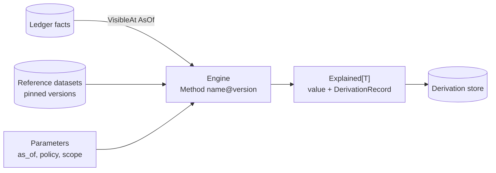

# Financial Engines

> **Provisional.** This document is a proposal produced by the 2026-08-07
> architectural audit. It is **not accepted**. Nothing may be implemented
> against it until an RFC and ADR accept it (ADR-0000, `AGENTS.md`). Where
> this document conflicts with an accepted ADR, the ADR governs until
> superseded.

An *engine* is FDOS's word for a deterministic financial calculation with a
name, a version, and an audit trail. Engines are where Constitution §2
(Deterministic Engineering), §8 (Explainability) and §9 (Reproducibility)
stop being properties of the ledger and become properties of *answers*.

This document defines the engine contract, the preconditions no engine may
ship without, and the first four engines in build order — Portfolio, Fixed
Income, Risk — and the verdict on Credit Intelligence.

## 1. The engine contract

Every engine is a pure function:

```
(facts visible at AsOf, reference data at pinned versions, Method@version)
    → Explained[T]
```



Binding rules, all of which already have kernel substrate:

- **The inputs are total.** An engine consumes only: facts visible at an
  explicit `temporal.AsOf` (both coordinates, never defaulted — ADR-0009),
  reference data named by `provenance.ReferenceBinding` at explicit
  versions (ADR-0010), and declared parameters. Nothing else exists.
- **The method is versioned.** Every engine carries a `provenance.Method`
  (`name`, `version`). Changing *how* a number is computed is a new method
  version, recorded in every derivation it produces, so a 2031 regeneration
  of a 2026 report runs the 2026 method (ADR-0010, Constitution §9).
- **The result is `Explained[T]`, never bare `T`** (ADR-0012). The trace is
  produced by the computation through the `explained` combinators, not
  reconstructed afterwards.
- **No clock, no I/O, no randomness, no floats.** Engines live in `domain`
  packages under the purity analysers. Loading facts and reference data is
  the application layer's job; the engine receives values.
- **Rounding is explicit and recorded.** Every division and every
  settlement-scale operation names its rounding context, and the context is
  a derivation parameter (ADR-0008).

## 2. Preconditions — what must exist before engines scale

The audit found three gaps that make shipping engines today unsound. They
are preconditions, not preferences.

1. **The derivation store.** Today the `explained` combinators create
   intermediate `DerivationRecord`s and drop them (audit finding S7): after
   three chained operations the caller holds one record and dangling
   hashes. An engine whose explanation cannot be rendered is a calculator
   with a marketing claim. The store is specified in
   [Knowledge-Layer.md](Knowledge-Layer.md) and needs its own RFC. No
   engine ships before it.
2. **Derivation-address integrity.** The content address is currently
   non-injective (audit finding K-C3: unescaped concatenation — measured
   collisions between a derivation that pins an FX dataset and one that
   pins nothing) and `Fold`'s seed is untraced (K-C4: two different totals
   share one address). Engines mint derivations by the thousand; these two
   defects must be fixed first or the derivation store fills with
   colliding lies.
3. **Analyser integrity or an honest rung.** The purity analysers are
   currently bypassable by a named float type, an indirect clock call, or
   package-level mutable state (audit finding E-C1). Either the analysers
   are extended before engine code multiplies, or Constitution §15 rows
   2/3/10 are corrected downward — §15 explicitly sanctions downward
   correction. An engine platform must not rest on a rung-2 claim that is
   syntactic.

Kernel additions engines require (from the audit's missing-concepts list):
`Date` (calendar date — accrual boundaries and ex-dates are jurisdictional
calendar dates, not UTC instants), `Quantize(scale, RoundingContext)`
(currency rounding is currently inexpressible — K-C1), `Allocate`/`Split`
(penny-exact distribution), interval algebra (`Overlaps`, `Intersect`,
`Duration`), and a dimensioned Rate/Price type (today `Money × Quantity`
ignores units entirely).

## 3. Portfolio engine

The first engine, because it is the platform's product: *what do I hold,
and what is it worth, as of a coordinate?*

**Positions.** Extends the existing `ProjectPosition` fold with the two
corrections the audit demands:

- **Alias resolution.** The projection must traverse `EntitiesIdentified`
  assertions when matching instruments. Today it matches on byte-equality
  of resolved IDs, so one instrument arriving from several brokers under
  several schemes silently splits into several positions — the platform's
  normal case, broken. The alias graph exists; it is unwired.
- **Correction semantics.** `Corrected` and `Superseded` corrections must
  affect the fold (today only `Retracted` does). This depends on the
  correction redesign ADR proposed in the Ledger target-architecture
  document of this proposal set.

**Valuation.** `value(position, as_of) = quantity × price × fx`, where the
price is a `PriceObserved` fact visible at the as-of, the FX rate is a
reference-dataset binding, the multiplication is dimensioned
(shares × currency-per-share), and the final amount is quantized to the
currency's minor unit under a named rounding context. Every input appears
in the derivation: the price fact ref, the FX dataset version, the
rounding context.

**Cost basis and tax lots.** Jurisdiction-pluggable *policies*, each a
versioned `Method` — never configuration:

| Policy | Method (illustrative) | Jurisdiction |
|---|---|---|
| Average cost | `portfolio.CostBasis/avg@1` | Brazil (equities and funds average by rule) |
| FIFO | `portfolio.CostBasis/fifo@1` | Default elsewhere |
| Specific lot | `portfolio.CostBasis/lot@1` | Where lot relief is elected |

A policy choice is a derivation parameter. Two reports under two policies
have two different content addresses, which is exactly right. Tax-lot
state is — like every position — a projection over occurrences, never
stored.

## 4. Fixed Income engine

Second, because the ecosystem's first data sources are Brazilian brokerage
and treasury positions, where fixed income dominates and *accrual* is the
calculation users check daily.

- **Accrual is interval arithmetic.** `accrued(instrument, [from, to))`
  over kernel `Date`s and the interval algebra, under a day-count
  convention.
- **Day-count conventions are versioned reference data**, not code
  constants: `bus/252` (the Brazilian standard, which additionally needs
  the holiday calendar as a pinned dataset), `30/360`, `act/365`,
  `act/act`. A convention is a `ReferenceBinding`; the business-day
  calendar is another.
- **First instrument families:** CDI-indexed (percentage-of-index daily
  accrual), inflation-indexed (IPCA lag conventions), and fixed-rate
  instruments. Each is a versioned Method over the same substrate. Index
  fixings (CDI daily rate, IPCA monthly) are `PriceObserved`-class facts
  or reference datasets — decided in the reference-data RFC, not here.
- Yield and mark-to-market arrive after accrual: they need a curve, and a
  curve is a reference dataset with its own versioning discipline.

## 5. Risk engine

Third, and deliberately modest: risk begins as **deterministic
decomposition**, not statistics.

- Exposure by instrument, issuer, currency, asset class — aggregations
  over valued positions, each an `Explained` fold.
- Concentration (top-N weight, single-issuer share) and FX decomposition.
- **Statistical risk (VaR, volatility, correlation) is explicitly
  deferred.** When it arrives, the boundary is: a model estimate is a
  *derivation* with a method, parameters, confidence, and pinned inputs —
  it is never a fact, and nothing downstream may treat it as one. The
  Occurrence/Observation taxonomy does not acquire a "Predicted" kind;
  predictions live in the knowledge layer as derivations.

## 6. Credit Intelligence — cut it

Verdict: **remove Credit Intelligence from the near-term context map
entirely.** It appears exactly once in the corpus (ADR-0013, as a
hypothetical bounded context), has no data source anywhere in the
ecosystem, no consumer, and no defined question it answers. Naming it in
the module topology now is speculative scope — the exact thing the
Constitution's "prefer deleting complexity" clause exists to refuse.

Keep the *name* reserved in the domain vision so nobody spends it on
something else; build nothing; revisit if and when a credit data source
actually enters the ecosystem through a connector.

## 7. The LLM boundary, restated for engines

Engines calculate; models render. The enforced form already exists and is
the best part of the AI story: `kernel.v1.ModelOutput` carries prose plus
the `DerivationRef` it explains, and no operation anywhere converts model
output into anything the ledger or an engine accepts (Constitution §2).
The engine architecture adds one obligation: **every engine result is
renderable** — its full derivation DAG resolves in the derivation store —
so the model always has a complete trace to render, and never a reason to
improvise one.

## 8. Module placement

Engines follow ADR-0013: one module per bounded context, layers as
packages.

```
libs/
  portfolio/            # bounded context: positions, valuation, cost basis
    domain/             # engines (pure)
    app/                # loading facts + reference data, derivation recording
    adapters/
  fixedincome/          # bounded context: accrual, day count, instruments
    domain/ app/ adapters/
  risk/                 # bounded context: decomposition (later)
```

`libs/reference` (specified in the Canonical-Financial-Model document of
this proposal set) precedes all three: valuation and accrual are consumers
of versioned reference data, and today `ReferenceBinding` pins versions of
datasets that do not exist.

## 9. Open questions routed to RFCs

1. The derivation store (with Knowledge-Layer.md) — blocking.
2. Kernel additions: `Date`, `Quantize`, `Allocate`, interval algebra,
   dimensioned rates — one RFC, since they interlock.
3. Reference data: dataset model, versioning, publication, first datasets
   (business-day calendar, day-count conventions, FX, index fixings).
4. Cost-basis policy set for Brazil, with worked golden tests per policy.
5. Whether index fixings are facts or reference data (the answer shapes
   both the Fixed Income engine and market-data ingestion).
