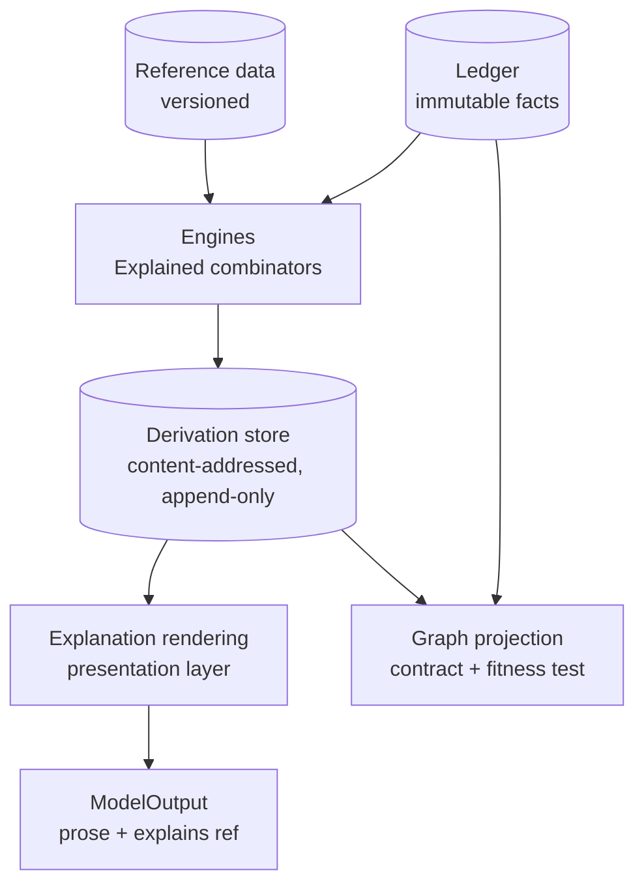

# Knowledge Layer

> **Provisional.** This document is a proposal produced by the 2026-08-07
> architectural audit. It is **not accepted**. Nothing may be implemented
> against it until an RFC and ADR accept it (ADR-0000, `AGENTS.md`). Where
> this document conflicts with an accepted ADR, the ADR governs until
> superseded.

The knowledge layer is what turns a ledger of facts into a platform of
answers: the stored derivations that make every number explainable
(Constitution §8), the rendering path that turns a derivation into prose,
and the graph question Constitution §12 has carried at rung 6 since M0.



## 1. The derivation store — the missing sink

**The gap.** ADR-0012 made `Explained[T]` the mandatory return type, and
the combinators build a `DerivationRecord` per step. But nothing stores
them. Each combinator keeps only the newest record; after
`Map(Map(Map(x)))` the caller holds one record and two hashes pointing at
records that were never written anywhere (audit finding S7). The content
address is "what is persisted" by design (`libs/kernel/explained`), and
there is no store to persist it in. Explainability is currently a
per-process illusion, and the first real attempt to render a trace will
find the middle of every DAG missing. This — not adoption ceremony — is
what predicts abandonment of `Explained[T]`.

**The proposal.** A derivation store: content-addressed, append-only,
write-once-per-address.

- **Keyed by the derivation's content address.** Identical derivations
  deduplicate for free; a re-run of the same method over the same inputs
  with the same parameters is the same address, which is the
  reproducibility property (Constitution §9) made physical.
- **Append-only, no delete, no update.** Same posture as the ledger: a
  derivation, once produced, is part of the audit record.
- **Stored shape:** the full record — method (name, version), input hashes
  (fact refs and upstream derivation addresses), parameters, reference
  bindings, confidence — in the wire form `fdos.kernel.v1` already
  defines (`DerivationRecord`), so storage inherits contract evolution
  rather than inventing an encoding. Note the audit's B-003 remainder:
  the derivation types currently have **no Go↔wire codec**; that codec and
  its round-trip conformance are part of this work, not optional.

**Integrity preconditions — blocking.** Two audit findings must be fixed
*before* the store exists, because both are baked into addresses forever:

1. **K-C3, non-injective addresses.** The pre-image concatenates
   caller-supplied strings with unescaped delimiters; measured collisions
   include a derivation pinning an FX dataset colliding with one pinning
   nothing. Fix: length-prefixed, domain-tagged canonical encoding
   (`fdos.derivation.v1` prefix), control characters rejected in names.
2. **K-C4, untraced Fold seed.** `Fold(inputs, seed)` folds the seed into
   the value and omits it from the trace, so two different totals share
   one address. Fix: the seed becomes a traced `Value[B]` — an opening
   balance is a fact, not a knob.

A store built before these fixes fills with colliding lies and cannot be
repaired afterward — an append-only store cannot re-key its history.

**The write path — keeping the domain pure.** Combinators are pure and
must stay so (no I/O in `domain`). The recorder is an interface at the
application layer:

```
// app layer (illustrative)
type DerivationRecorder interface {
    Record(ctx context.Context, rec provenance.DerivationRecord) error
}
```

The application layer collects the records a computation produced and
writes them alongside the computation's result — the same transactional
discipline the ledger uses for facts. What this requires of the kernel: a
way to *enumerate* the records a chain produced (today each step's record
displaces the last). The cheapest honest shape is combinators that
accumulate records into the returned `Value[T]` (a `Records()` walk), so
the app layer drains them; a global collector is rejected — it is shared
mutable state in disguise, exactly what the impurity rule forbids.

This store needs its own RFC. It is the blocking precondition for every
engine (see [Financial-Engines.md](Financial-Engines.md)) and for the
`explain` tool on the MCP surface (see [MCP.md](MCP.md)).

## 2. Explanation rendering

Rendering walks the DAG from a root address:

1. Resolve the address in the derivation store.
2. For each input: a **fact ref** resolves against the ledger to its
   envelope (source, collected-at, effective interval, knowledge time,
   interpreter, confidence); a **derivation address** recurses.
3. Emit the tree: method@version at each node, parameters and reference
   bindings in place, confidence propagated as recorded (weakest-input
   rule, never arithmetic).

Rendering is presentation-layer work (`app`/`adapters`, per ADR-0012's
scoping), and the LLM's only role is prose over the resolved tree,
travelling as `ModelOutput` with the `explains` ref attached. Two
disciplines: rendering **never truncates silently** — a pruned subtree is
marked pruned, because a trace that hides inputs is a story, not an
explanation (Constitution §6); and rendering **never fills gaps** — a
dangling address is reported as a defect, which is precisely the signal
that would have caught S7 on day one.

## 3. Knowledge graph — justify or reject

**Verdict: reject the graph database. Accept the graph as a projection
contract.**

Constitution §12 already contains the right sentence: *"The graph is
never the source of truth; it is a semantic projection over immutable
financial facts."* What the corpus never did is test the "every canonical
model naturally supports graph projection" half — §12 is the only
principle still at rung 6, with a target (rung 5) that concedes it will
never be an invariant. This proposal makes it checkable instead.

**Why no graph engine now.** Every graph-shaped question currently
askable is answerable relationally with bounded joins:

| Question | Shape | Relational answer |
|---|---|---|
| Which entities are aliases of X? | 1-hop over `EntitiesIdentified` | join, or transitive closure over a small set |
| What claims name identifier Y? | 1-hop | index lookup |
| What did derivation D consume? | DAG walk, known depth | recursive resolve in the derivation store |
| Which facts fed this report? | leaf set of a DAG | same walk |

A graph engine earns its complexity only when a query has **runtime-
variable paths at depth ≥ 3 across heterogeneous edge types** — "show me
every position whose issuer is connected to entity Z through ownership or
guarantee chains" — and no such query exists, no such edge data exists
(ownership/guarantee data would arrive through connectors that do not
exist), and adopting a graph store now would add a second storage engine,
a second query language, and a second consistency story to a platform
that cannot yet answer "what do I hold". Reconsider when a concrete query
of that shape has a data source; record the reconsideration trigger, and
until then spend nothing.

**The projection contract — cheap and testable today.**

- **Nodes:** minted entities (`EntityMinted` facts: instruments, parties,
  accounts, streams).
- **Edges:** `EntitiesIdentified` (same-as, weighted), identifier claims
  (entity → external identifier assertion, timestamped), derivation input
  edges (derivation → fact refs and upstream derivations), and correction
  edges (correction → corrected fact).
- **Every edge carries its bitemporal coordinates** — the graph at an
  as-of pair is a deterministic function of the facts visible at that
  pair, which is what "projection, never truth" means operationally.

**One fitness test.** A test that folds a small fact stream into the
node/edge set above and asserts the projection is total (no fact type
falls outside it) moves §12 from asserted to checked — rung 3 — for the
cost of one test file. When a new fact type is added and the projection
cannot express it, the test fails, which is exactly the moment the
modelling conversation should happen.

## 4. Storage split rule

One sentence, intended for the eventual ADR: **relational storage owns
facts, projections, reference data, and derivations; a graph engine, if
one is ever justified, is a disposable projection cache rebuilt from the
ledger, and nothing may read it as truth.** The rule is the same one the
event store already follows for its bitemporal index ("the index is not a
second source of truth — it must be rebuildable from the facts alone",
ADR-0034), applied one layer up.

## 5. Open questions routed to RFCs

1. **The derivation store RFC** — storage engine (the ledger's SQLite
   store is the obvious first home; same file or sibling?), the recorder
   interface, the combinator accumulation change, the derivation codec
   (B-003's unpaid half), and retention (append-only forever, or
   address-reachability from persisted report roots?).
2. **Whether a rendered explanation is itself recorded** — a
   `ModelOutput` is reproducible only if the renderer version and the
   resolved tree are pinned; decide whether renderings are cached
   artifacts or always recomputed.
3. **The graph fitness test's home** — `libs/ledger` (it is a projection
   over ledger facts) versus a future `libs/knowledge` module; the test
   should exist either way before the next fact type ships.
