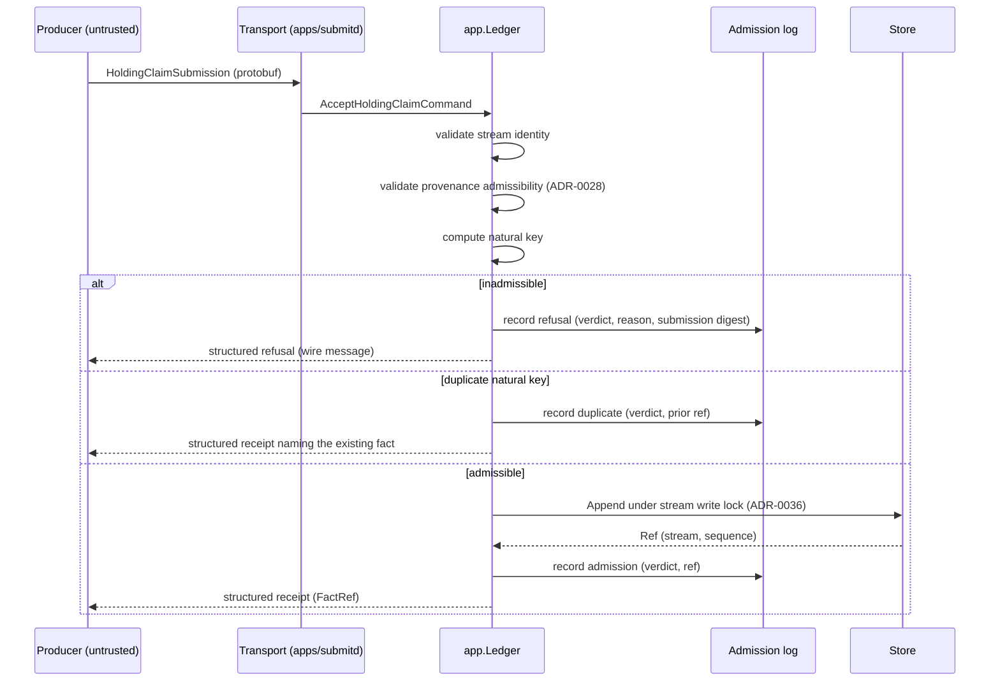

# Ledger — target architecture

> **Provisional.** This document is a proposal produced by the 2026-08-07
> architectural audit. It is **not accepted**. Per ADR-0000 and `AGENTS.md`,
> nothing may be implemented against it until an RFC and ADR accept the
> relevant section. Where this document conflicts with an accepted ADR, the
> ADR governs until superseded.

This document consolidates the ledger decisions that exist — ADR-0028
(provenance admissibility), ADR-0029/ADR-0037 (claims and delivery), ADR-0030
(the submission shape), ADR-0033 (minting), ADR-0034 (the event store),
ADR-0035 (the SQLite driver), ADR-0036 (knowledge time under the write lock) —
and states the target they should converge on. Each numbered gap below was
verified by execution during the audit; none is speculative.

---

## 1. The admission path

Target shape, end to end:



Four changes from today, in decreasing order of urgency:

**1a. Admissibility runs on every write path.** `Source.CheckContentAddress`
is currently enforced on two of five write use cases (`AcceptHoldingClaim`,
`MintIdentity`); `ObserveHolding`, `CorrectFact` and `ObserveClaimedHolding`
skip it, and the test fixtures exploit the gap (`broker.statement` as a
source). The rationale for checking at admission rather than decode is
correct; it does not justify three unchecked admission paths. One shared
admission guard, called by every use case that appends.

**1b. The stream name is validated.** Today an empty stream name returns
`201 Created` and writes a row `Load` can never read — anonymous, write-only
data loss, measured end to end. Minimum: non-empty, length-bounded,
shape-validated at the command boundary, with the memory and SQLite stores
agreeing (today they do not — only the memory store routes through
`domain.NewStream`). Target: §5's minted stream identity.

**1c. Submissions are idempotent by natural key.** A producer retry today
writes a permanent duplicate fact; the transport's own comments predict the
retry. The submission already carries every component of a natural key:

```
natural_key = sha256( source.content_hash
                    ‖ collected_at
                    ‖ effective.from ‖ effective.to
                    ‖ canonical(account claim) ‖ canonical(instrument claim)
                    ‖ quantity )
```

A unique index on `(stream, natural_key)` closes the hole at the storage
layer; a duplicate returns the existing `Ref` as a receipt, not an error.
Length-prefix every component (the audit measured hash-collision defects from
unescaped concatenation elsewhere; do not repeat the pattern here).

**1d. Refusals are recorded — outside the ledger.** Today a refused
submission vanishes; the one decision the system makes that leaves no trace
is the decision to refuse. Position: refusals go to a separate append-only
**admission log**, not the ledger. Attacker-controlled bytes do not belong in
the truth path, but "what did this producer send that we refused, and when"
must be answerable. The log records verdict, reason, timestamp, and the
submission's content digest (bytes retained separately, capped). This needs
its own RFC; the position taken here is the recommendation, and either answer
must be decided rather than defaulted.

**1e. The response is a contract.** The wire defines the request only;
receipts and refusals are unspecified plain text today, unusable from the
non-Go producers the submission message exists for. A response message
(receipt: `FactRef` + natural key echo; refusal: machine-readable reason
code + human text) belongs in `libs/contracts` beside the submission.

---

## 2. The event store

The store's write-path reasoning (ADR-0034) survives contact with the audit.
Its encodings do not. Target schema:

```sql
CREATE TABLE facts (
    stream          TEXT    NOT NULL,  -- stream identity (§5), not a free string
    sequence        INTEGER NOT NULL,  -- assigned by the store: MAX(sequence)+1
    effective_from  INTEGER NOT NULL,  -- UTC nanoseconds since the Unix epoch
    effective_to    INTEGER,           -- NULL = open interval
    knowledge       INTEGER NOT NULL,  -- UTC nanoseconds since the Unix epoch
    kind            INTEGER NOT NULL,
    type            TEXT    NOT NULL,
    type_version    INTEGER NOT NULL,
    natural_key     BLOB,              -- §1c; NULL for facts FDOS itself derives
    encoded         BLOB    NOT NULL,  -- wire bytes as written; upcast on read
    PRIMARY KEY (stream, sequence)
);

CREATE INDEX facts_as_of
    ON facts (stream, effective_from, knowledge, sequence);

CREATE UNIQUE INDEX facts_natural_key
    ON facts (stream, natural_key)
    WHERE natural_key IS NOT NULL;
```

The changes, each anchored to a measured defect:

**2a. Temporal columns are integers.** The shipped store compares knowledge
times as RFC3339Nano strings; the format trims trailing fractional zeros, so
lexicographic order is not chronological order. Measured consequence: the
SQLite store refuses an append the memory store accepts — the two
implementations of `app.Store` disagree on the one property the conformance
suite exists to pin, and a producer sees a spurious `409` blaming another
writer. The same string ordering sits in the as-of index, so the first real
as-of SQL query would return wrong answers rather than slow ones. Integer
nanoseconds close all of it. The suite gains a case with sub-second,
variable-width timestamps — the fixture family that would have caught this
uses whole hours.

**2b. Sequence assignment is `MAX(sequence)+1`, and `Load` verifies.** The
shipped store derives the next sequence from `COUNT(*)` and `Load` discards
persisted sequences, reassigning by position. Measured consequence: deleting
one row silently renumbers every later fact — every derivation record naming
`stream#n` re-points to a different fact — and the stream becomes permanently
unwritable on primary-key collision. `MAX(sequence)+1` fixes assignment;
`Load` asserting that each replayed ref equals the stored ref turns a gap
from silent corruption into a loud integrity failure.

**2c. Reads become incremental; the index earns its comment.** Reads are
O(n²) today — measured 14.2 s to load 32k facts, 2m52s for
`UnresolvedClaims` at the same size; the ceiling is `domain.Stream`'s
copy-per-append plus whole-stream `Load`, and it follows the design onto any
storage engine. Target: `Load(name, fromSequence)` (`WHERE sequence > ?`),
an O(1) in-memory append, a `VisibleAt` that does not re-sort, and as-of
predicates pushed to SQL — the `facts_as_of` index currently accelerates no
query that exists, despite ADR-0034's text. ADR-0034 recorded the deferral as
O(history); the measured cost is quadratic, which is grounds to reopen the
recorded decision on its own terms.

**2d. Snapshots are rebuildable caches.** Constitution §5 permits
materialised views "for performance"; nothing decides them. Target: a
snapshot is `(stream, upto_sequence, method, method_version, encoded
projection)`, derived purely from facts, verifiable by replay
(byte-identical projection and derivation addresses with the snapshot
deleted), and invalidated by nothing — a newer snapshot supersedes, the
ledger remains the only truth. Needs its own RFC before any stream reaches
10⁵ facts.

---

## 3. Schema evolution — the upcaster architecture

ADR-0011 decided upcast-on-read; RFC-0014 made it load-bearing for storage
(the store persists wire bytes). The tree contains no upcaster, and
`DecodeFact` hard-rejects any version mismatch while `Load` aborts on the
first decode error: **the first `TypeVersion` bump makes every persisted
stream unloadable**, with migration constitutionally forbidden. This is the
largest deferred-cost item in the ledger. Target:

- An upcaster **registry** in `libs/ledger-wire`: `map[(type, version)] →
  func(vN) (vN+1, error)` — pure, deterministic, total, lossless, exactly as
  ADR-0011 specified.
- Decode resolves the chain `stored_version → current_version` and applies
  it; a missing link is a loud, named error, not a rejected fact.
- The chain applied is **pinned in the reading computation's provenance**,
  exactly as reference datasets are (ADR-0010) — replaying a 2026 fact in
  2031 records which upcasters read it.
- The promised round-trip property test: for every registered payload
  version, upcasting preserves all information (encode vN → upcast → the
  vN-derivable fields survive byte-exactly).
- Direct chains only until a real need for composition exists — ADR-0011's
  open question, answered conservatively.
- **Reserved-field policy now, while nothing has been deleted**: every proto
  file adopts `reserved` for any removed field or number; the breaking gate
  gains protection against number reuse. Cost today: zero. Cost after the
  first deletion: a silent wire-compatibility trap.

---

## 4. Corrections redesign

The shipped `FactCorrected` payload carries `Corrects`, `Kind`, `Reason` —
no replacement value, no superseding reference. Measured consequence: kinds
`Corrected` and `Superseded` are accepted, ledgered, and **ignored by every
projection**; an auditor records "this figure was wrong", the ledger agrees,
and every read returns the wrong figure. ADR-0011 decided three *distinct
types*; the enum collapse is what let two of three go unhandled. Target:

| Type | Carries | Projection obligation |
|---|---|---|
| `FactRetracted` | corrected ref, reason | Exclude the target from every fold (works today) |
| `FactCorrected` | corrected ref, reason, **replacement payload** (same type, own envelope) | Substitute the replacement for the target |
| `FactSuperseded` | corrected ref, reason, **superseding ref** | Prefer the named fact over the target |

Correction-of-correction semantics, decided rather than defaulted: a
retraction of a retraction restores visibility of the original (measured
today: it does not — a no-op); a correction chain resolves to the newest
correction visible at the query's knowledge coordinate. Projections that
consume corrections must handle all three kinds **by exhaustive type
switch** — the mechanical property the three-type design buys and the enum
design forfeited. This is a payload contract change and needs an RFC; it is
the clearest case in the audit of an implementation deviating from an
accepted ADR.

---

## 5. Stream topology

Today the stream is a producer-supplied free string — "the producer's choice
of where this belongs" — which ADR-0011 forbids: "stream assignment is
structural, derived from the aggregate the fact concerns, never a routing
decision." The type that makes the ADR true already exists and is used
nowhere: `identity.KindLedgerStream`. Target:

- **A stream is a minted identity** derived from the aggregate it serves —
  for holdings, the account: `stream = Derive(KindLedgerStream,
  account-identity)`. The producer names the *account* (as a claim, exactly
  as it names instruments); FDOS resolves the claim and computes the stream.
  A producer never routes.
- **Cross-stream projection is a stated rule, not an accident.** A portfolio
  spans accounts; accounts are streams; today cross-stream references are
  refused by `Stream.Get` and cross-stream ordering is undefined — a
  multi-account portfolio is unrepresentable. Target rule, per ADR-0009's
  own instruction that "a projection needing one states its own
  deterministic rule": a cross-stream projection totally orders facts by
  `(effective_from, knowledge, stream-identity, sequence)` — stream identity
  as the deterministic tiebreaker — and records the participating streams
  and their high-water sequences in its derivation.
- **No global sequence.** A cross-stream total order per projection is
  sufficient, deterministic, and does not serialise unrelated writers. If a
  future consumer needs a global order, that is a new decision, not a
  default.

---

## 6. Concurrency honesty

- **FDOS is globally single-writer today.** The 256-way sharded stream lock
  is defeated one layer down by `SetMaxOpenConns(1)`: every append in the
  process funnels through one connection. Defensible for SQLite — but no
  document says it, and the sharding reads as if streams proceed
  independently. State it where operators read.
- **Knowledge time for batches is a semantics question, and its RFC comes
  before any batch endpoint.** A 500-line broker statement is one epistemic
  event; strict per-stream monotonicity forces it into 500 artificial
  instants in arbitrary order. ADR-0036's declined alternative E (hybrid
  clock, `max(now, last+ε)`) changes what a recorded knowledge time means
  and was rightly routed to its own RFC — that RFC is a prerequisite of
  batch ingestion, not a follow-up to it.
- **Wall clock, no skew story.** Knowledge time is a bare wall clock; a
  backwards NTP step stalls every stream and the error blames "another
  writer". Minimum: detect regression against the stream head and name it
  honestly in the error. The full answer arrives with alternative E.
- **Multi-process writers remain unprotected** (recorded honestly in
  ADR-0036: "no deployment story may imply otherwise"). The path is the
  additive Postgres adapter ADR-0035 already sketches (`libs/ledger-postgres`
  against the engine-agnostic `app.Store`), which is also where ADR-0034's
  `Expectation` machinery meets the multi-writer case it was designed for
  and has never been exercised against.

---

## 7. What to delete

Prefer removing surface to guarding it:

- **`Stream.Save`-era whole-stream reads**: once §2c lands, the whole-stream
  `Load` is a special case of incremental load, not an API.
- **The producer-facing `stream` string** (§5): replaced by an account
  claim; one less thing D2 has to guard.
- **`IntervalAt`** in the kernel (degenerate `[at, at]`): visible only to a
  nanosecond-exact query; unused today, a sprung trap for the first
  point-in-time fact. Replace with `[at, at+1ns)` semantics or delete.
- **The unused `facts_as_of` comment claims**: either the SQL as-of query
  exists (§2c) or the index and its documentation go. An index that
  "accelerates the query we intend to write" is documentation debt wearing a
  schema.

---

## Decision sequence

1. **Integrity fixes needing no RFC** (they implement accepted decisions
   correctly): integer temporal encoding, `MAX(sequence)+1`, `Load`
   verification, admissibility on all write paths, stream-name validation.
2. **One RFC: idempotency + admission log + response contract** (§1c–1e) —
   one coherent admission-semantics decision.
3. **One RFC: corrections** (§4) — supersedes the payload shape, not the
   taxonomy.
4. **One RFC: upcasters** (§3) — before any payload's first version bump.
5. **One RFC: stream topology** (§5) — before a second account exists in
   anger; prerequisite for any portfolio projection.
6. **One RFC: read path** (§2c–2d, snapshots) — before any stream reaches
   10⁵ facts.
7. **One RFC: knowledge time for batches** (§6) — before any batch endpoint.
