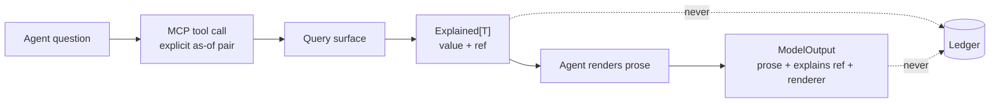

# MCP Architecture

> **Provisional.** This document is a proposal produced by the 2026-08-07
> architectural audit. It is **not accepted**. Nothing may be implemented
> against it until an RFC and ADR accept it (ADR-0000, `AGENTS.md`). Where
> this document conflicts with an accepted ADR, the ADR governs until
> superseded.

The MCP surface is how AI agents reach FDOS. Its design question is not
"which tools" but "which *side of the truth boundary*": Constitution §2
permits models to explain, summarise and communicate, never to become the
source of financial truth. The MCP surface is therefore a **read-only
projection of domain capabilities** — never a data browser, never a write
path.

## 1. Position: capabilities, never raw rows

The responsibility matrix already decides this: *"MCP surface — exposes
canonical model, not raw acquisitions"* (`docs/ecosystem/boundary.md`).
This proposal sharpens it: the MCP exposes **questions the domain can
answer**, each carrying its explanation, and nothing else.

A raw-data MCP (`select * from facts`) would be strictly worse on every
axis FDOS cares about: it moves interpretation into the model (violating
§2 in spirit), strips derivations (violating §8), invites "now"-defaulted
queries (violating §7), and couples the model to storage shape (violating
§11). It is rejected.

## 2. Preconditions

Two, both hard:

1. **D2 is decided.** "Who may call the MCP surface" is the same open
   question as "who may write to a stream" (`docs/ecosystem/boundary.md`,
   D2; issue fdos#64). ADR-0038 already anticipates the MCP server as a
   listener that inherits the patch-line obligation; it must equally
   inherit the D2 answer. No MCP endpoint before it.
2. **The query surface exists.** Six of seven ledger use cases currently
   have zero production callers and there is no read endpoint anywhere. An
   MCP server today would be an API over nothing. The query-surface RFC
   precedes this one.

## 3. Tool inventory

| Tool | Signature (conceptual) | Returns |
|---|---|---|
| `project_position` | `(account, instrument, as_of_effective, as_of_knowledge)` | quantity + valuation, with derivation ref |
| `project_portfolio` | `(account_set, as_of_effective, as_of_knowledge)` | positions list, each with derivation ref |
| `explain` | `(derivation_ref)` | the resolved derivation DAG: method@version, inputs, parameters, reference bindings, confidence |
| `provenance_of` | `(fact_ref)` | envelope: source, collected_at, effective interval, knowledge time, interpreter, confidence |
| `list_corrections` | `(fact_ref)` | corrections targeting the fact, with kinds and reasons |
| `unresolved_claims` | `(stream, as_of_knowledge)` | claims awaiting identity resolution |
| `list_reference_versions` | `(dataset)` | published versions of a reference dataset |

Three disciplines, enforced in the tool schema itself:

- **Every temporal tool requires an explicit as-of pair.** No tool has a
  "now" default. This is the kernel's rung-1 rule (`temporal.AsOf` has no
  zero value and no default — ADR-0009) extended to the model-facing
  schema: the schema marks both coordinates required, so a model that
  omits them gets a schema error, not silent look-ahead bias.
- **Every numeric answer carries its derivation ref.** A number without a
  trace does not cross this surface. `explain` then resolves the trace on
  demand — which is why the derivation store (Knowledge-Layer.md) is a
  dependency of this design.
- **Scoping is structural.** Every tool takes an account/stream scope as
  its first argument, so when D2 lands, authorization attaches per-scope
  rather than per-endpoint. The tool contract is designed today so the
  authorization model has something to grab.

## 4. What the MCP must never expose

- **Mutation of any kind.** Submission stays on the ingest path
  (`fdos.ingest.v1`, ADR-0030/0037); minting stays an owned human act
  (ADR-0033). A model that can write toward the ledger is the failure §2
  exists to prevent — the read-only property is not a configuration, it
  is the absence of any write tool.
- **Raw fact payloads without envelopes.** Provenance travels or the datum
  does not (Constitution §6).
- **Any path from model output to admission.** `kernel.v1.ModelOutput` is
  structurally unreachable from `Fact`, and the MCP server must preserve
  that: nothing a model produces through this surface is accepted back
  through it.

## 5. Rendering and ModelOutput

An LLM may render a `DerivationRecord` into prose. The rendering travels
as `kernel.v1.ModelOutput`: the prose plus `explains` (the
`DerivationRef` it narrates) plus `renderer` (the versioned
`InterpreterRef` of the model). The record and the prose are inseparable
on the wire, so a downstream consumer can always distinguish the
deterministic answer from its narration — and re-render the narration
without recomputing the answer.

## 6. Wire and generation

ADR-0018 deferred MCP tool generation deliberately ("the generator must
stay pluggable and versioned separately"). This proposal keeps that:

- Tool schemas are **generated from the contracts module** — the same
  protobuf surface that defines `Explained`, `DerivationRecord`,
  `TemporalCoordinates` — so the MCP never invents a second definition of
  a canonical concept (the B-003 lesson: two definitions of one concept
  diverge).
- The generator and the served tool set version separately from
  `libs/contracts`, because MCP is a moving target and a protocol bump
  must not force a contract release.
- The server is a composition root in `apps/` (per `apps/README.md`),
  binding the query surface to the MCP transport, with the same
  loopback-by-default posture ADR-0037 established for `submitd` until D2
  answers who may call it.

## 7. The minimum AI architecture

One renderer, not an agent fleet. The platform needs: (1) this read-only
capability surface, (2) one rendering path producing `ModelOutput`, and
(3) nothing else until a concrete question demands it. Agent
proliferation is a cost centre without a truth-path justification; every
additional agent is another consumer of the same seven tools, not a
reason for new ones.

## 8. Open questions routed to RFCs

1. The query surface itself (precedes this document entirely).
2. D2 — platform identity and per-scope authorization.
3. Whether `project_portfolio` spans accounts across streams — depends on
   the stream-topology decision in the Ledger proposal.
4. Rate limiting and result-size bounds for model callers (a model can
   ask for a million-fact explanation; the surface needs a stated
   truncation-with-continuation discipline that never silently drops
   inputs from a rendered trace).
