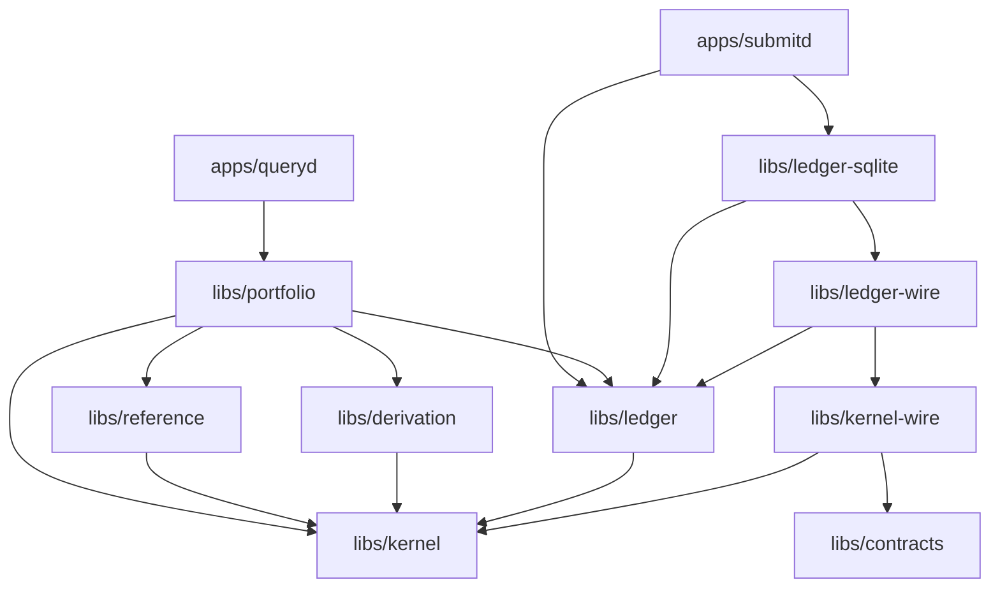

> **Provisional.** This document is a proposal produced by the 2026-08-07
> architectural audit. It is not accepted. Nothing may be implemented against
> it until an RFC and ADR accept the relevant part (ADR-0000,
> [AGENTS.md](../../AGENTS.md)). Where this document conflicts with an
> accepted ADR, the ADR governs until superseded.

# Repository Architecture

What the repository is today, what it must become to carry the platform, and
which structural decisions stay exactly as they are.

## What stays

Three structural decisions survived the audit unchallenged and should be
treated as settled:

- **The two-repository boundary.** `fdos` defines the financial language;
  `fdos-connectors` translates providers into it, consuming
  [`libs/contracts`](../../libs/contracts/README.md) at a pinned version
  (ADR-0023, ADR-0026). The four boundary tests in
  [`docs/ecosystem/boundary.md`](../ecosystem/boundary.md) resolved every
  dispute they were applied to. **No third repository should exist.** Every
  new concern lands in one of the two, decided by the existing tests.
- **One module per bounded context, layers as packages** (ADR-0004,
  ADR-0013). The `domain` / `app` / `adapters` split inside each context
  module is correct and is what made the audit's findings localisable.
- **`libs/contracts` as the only offered surface** (ADR-0025). Publishing
  everything while promising compatibility only for contracts is the right
  open-core posture.

## Current tree

Seven library modules, one application, three empty-by-design directories:

| Module | Holds |
|--------|-------|
| `libs/analysis` | The analysers that turn architectural principles into build errors |
| `libs/contracts` | The published contract surface — protobuf schemas and generated Go |
| `libs/kernel` | Canonical types: identity, money, temporal, provenance, explained |
| `libs/kernel-wire` | Kernel ↔ protobuf codecs and round-trip conformance |
| `libs/ledger` | The first bounded context: facts, claims, mints, resolution |
| `libs/ledger-wire` | Ledger ↔ protobuf codecs and round-trip conformance |
| `libs/ledger-sqlite` | The durable event store (ADR-0034, ADR-0035) |

Plus `apps/submitd` (the submission service, ADR-0037), and `deploy/`,
`examples/` (`examples/ingest` exists), `scripts/`.

### Known structural defects (from the audit)

- **`examples/` is entirely outside the verify gate.** `scripts/list-modules.sh`
  and `scripts/verify-gofmt.sh` both glob `libs apps` only, while `go.work`
  includes `examples/ingest`. The reference producer an external consumer
  copies is the least-verified Go in the repository, and its `go.mod` is
  provably untidy.
- **`libs/ledger-sqlite` is absent from `go.work`** while present in the
  module list — inside the gate, outside the editor workspace. The two lists
  are reconciled by nothing, in either direction.
- **Sibling modules are tested at stale version floors.** Each module's tests
  run standalone with `GOWORK=off` against its own `go.mod` floors
  (`libs/kernel-wire` tests against `kernel v0.5.0` while `apps/submitd`
  resolves `v0.7.0`), so the combination that ships is never the combination
  that is tested.

**Proposed mechanism:** a reconciliation check (a new `workspace-check`
target under the verify gate) asserting that (a) every module found by
`scripts/list-modules.sh` appears in `go.work` and vice versa, including
`examples/`, and (b) for every intra-repository dependency, the version floor
in each module's `go.mod` equals the highest floor any sibling declares — so
a bump anywhere forces the tested combination to be the shipped combination.

## Target tree

New context modules follow ADR-0013 exactly: one module per bounded context,
`domain` / `app` / `adapters` packages within, infrastructure-heavy adapters
in `<context>-<tech>` sibling modules, wire codecs in `<context>-wire`
sibling modules.

```text
libs/
  kernel/                 # unchanged scope + audit fixes (Date, Quantize,
  kernel-wire/            #   Allocate, Rate, interval algebra)
  contracts/              # + response messages, reference/marketdata packages
  analysis/               # + the analyser extensions or honest rung downgrade
  ledger/                 # + upcasters, correction redesign, admission log
  ledger-wire/
  ledger-sqlite/          # + integer-time encoding, MAX(sequence), snapshots
  derivation/             # NEW — the derivation store: content-addressed,
  derivation-sqlite/      #   append-only sink for Explained[T] records
  reference/              # NEW — instruments-as-entities, calendars,
  reference-wire/         #   versioned datasets; what ReferenceBinding pins
  reference-sqlite/
  marketdata/             # NEW (later) — price observations at volume;
  marketdata-wire/        #   gated on the batch-provenance RFC
  portfolio/              # NEW — read models: positions, valuation, exposure;
  portfolio-wire/         #   snapshots; cross-stream projection rule
  corporate-actions/      # NEW (later) — action types, effects as generated
  corporate-actions-wire/ #   occurrences with derivations
apps/
  submitd/                # existing write-side composition root
  queryd/                 # NEW — the read-side composition root: as-of
                          #   queries, explanations; the surface D2 gates
```

Positions taken, for the deciding RFCs to confirm or refute:

- **The derivation store is its own context module, not part of `ledger`.**
  Derivation records are produced by every context's calculations, not only
  the ledger's; folding the store into `ledger` would make every future
  engine depend on the ledger module for a concern that is really the
  kernel's `provenance` vocabulary plus persistence. The kernel itself stays
  minimal (ADR-0013): it defines `DerivationRecord`; it never stores one.
- **`portfolio` is a bounded context, not a package of `ledger`.** It owns
  read models and projections across streams; the ledger owns admission and
  truth. Sharing a module would blur the one boundary the Constitution's §1
  is built on (state derived, never stored beside facts).
- **`queryd` is a separate composition root from `submitd`.** The write and
  read sides have different scaling, different authorisation halves of D2,
  and different failure domains. One binary would couple them at exactly the
  point the architecture separates them.

### Module dependency direction (target)



The kernel depends on nothing; contexts depend on the kernel and (read-side
only) on each other in one direction: `portfolio` reads `ledger`, `reference`
and `derivation`; nothing depends on `portfolio` except its composition root.
The `layering` analyser must learn to classify the new modules — the audit
found it blind to every module outside `kernel` and `<context>/domain|app|adapters`,
including the wire modules whose separation ADR-0018 rests on.

## Versioning strategy

ADR-0004 (independent modules, subdirectory tags, `GOWORK=off` in CI) and
ADR-0024 (semver per module, breaking change as a process) stand. Two
additions:

1. **The floor-reconciliation rule above**, so minimal version selection
   stops hiding skew between siblings.
2. **Soak time** (see [Engineering-Principles.md](Engineering-Principles.md)):
   no newly-minted contract element is consumed externally in the milestone
   that minted it. The audit found `RoundingContext` reached a pinned
   external consumer with semantics no calculation had ever exercised.
