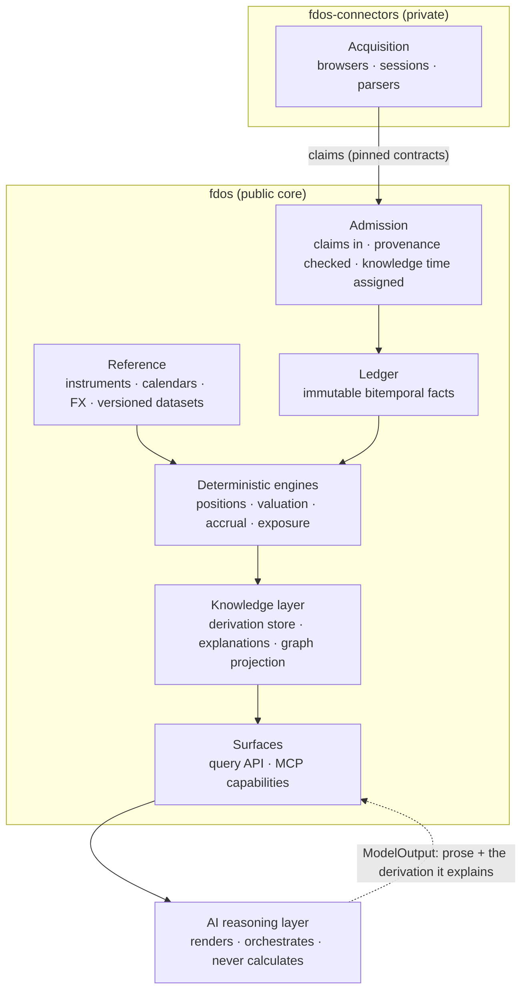

# FDOS Domain Vision

> **Status: provisional.** This is a proposal from the 2026-08-07 architectural
> audit. It is not an accepted decision; nothing may be implemented against it
> until an RFC/ADR accepts it, and accepted ADRs govern where they conflict
> (ADR-0000, `AGENTS.md`). It exists because ADR-0013 cites a binding "Domain
> Vision" twice, and no such document has ever existed. Accepting a version of
> this document closes that dangling authority.

## What FDOS is

FDOS is a **deterministic financial knowledge platform**. It transforms
heterogeneous financial information into facts that are immutable, bitemporal,
provenance-complete and explainable — and then answers questions about them
reproducibly, years later, to the byte.

The one-sentence test for every architectural decision:

> **Can the system show a regulator exactly what it knew, when it knew it,
> where it learned it, and how it computed every number it ever showed anyone —
> and produce the identical number again on demand?**

Data is the first layer, not the product. The product is the *answer*: a
position, a valuation, an exposure, a recommendation — always derived, always
explained, always reproducible from the ledger plus versioned reference data
plus versioned code.

## What FDOS is not

- **Not a broker integration platform.** Providers adapt to FDOS; FDOS never
  learns a provider's name, protocol, or quirks. That entire world lives in the
  private connectors repository, behind the Tier-0 boundary
  ([`docs/ecosystem/boundary.md`](../ecosystem/boundary.md)).
- **Not an AI product with a database.** Models render and orchestrate; they
  never calculate, never assert a fact, and are structurally unable to reach
  the ledger (`kernel.v1.ModelOutput` has no conversion path to any fact).
- **Not a trading system.** FDOS records and explains; it does not execute.
  Latency is never traded against correctness or provenance.
- **Not a general event-sourcing framework.** Every abstraction exists to carry
  financial semantics. A mechanism with no financial question behind it is
  scope creep, however elegant.

## The layered shape

Truth flows upward only. Every layer above the ledger is a projection of it;
nothing above the ledger writes into it. The AI layer is a consumer of
explained answers — the arrow back down carries commentary *about*
derivations, never data *into* them.

## The bounded-context map

This is the map ADR-0013 gestured at and never recorded. Contexts share the
kernel's vocabulary and nothing else.

| Context | Owns | Status |
|---|---|---|
| **Kernel** | Identity, money, time, provenance, explainability — the vocabulary every context speaks | Exists (`libs/kernel`) |
| **Ledger** | Admission, facts, corrections, minting, the event store | Exists (`libs/ledger`, `libs/ledger-sqlite`) |
| **Reference** | Instruments as described things, calendars, FX datasets — everything a `ReferenceBinding` can pin | Missing; first new context to sequence |
| **Portfolio** | Read models: positions, valuation, exposure; snapshots; the query surface | Missing; the platform's product |
| **Market Data** | Price observations at volume; batch provenance | Missing; blocked on batch-provenance and batch-knowledge-time decisions |
| **Corporate Actions** | Action schedules applied to holdings as generated, derived occurrences | Missing |
| **Analytics** | Versioned deterministic calculation methods beyond projection: cost basis, accrual, performance, risk decomposition | Missing; requires the derivation store first |

Credit Intelligence, named once in ADR-0013, is **deliberately absent**: it has
no data source in the ecosystem and no question it must answer today. The name
stays reserved; nothing is built.

## The decade test

A decision is vision-compatible when it survives all four:

1. **The 2031 regeneration.** A report produced in 2026 regenerates in 2031,
   byte-identical, from the ledger + pinned reference data + pinned code. Any
   mechanism that cannot be pinned — an unversioned method, an unrecorded
   parameter, a hash that two computations share — fails this test now, not in
   2031.
2. **The second provider.** Any abstraction shaped like one provider's view of
   the world belongs downstream of the boundary.
3. **The hostile producer.** Everything arriving from outside is revalidated at
   admission as if the producer lied; nothing a producer supplies is trusted
   because a published library produced it (ADR-0029 §2, carried by ADR-0037).
4. **The askable question.** Each milestone ends with a question a user can ask
   the system that they could not ask before. Infrastructure that changes no
   answer is deferred until it does.

## Where the vision stands today

The audit's honest summary: the epistemology is built — identity, time, money,
provenance, admission — and is genuinely reference-grade in intent. The
finance is not: no read surface, no reference data, no valuation, no corporate
actions, and a set of execution-verified integrity defects that must be closed
while the ledger is still empty. The continuation roadmap
([`Roadmap.md`](Roadmap.md)) sequences the gap; the point of this document is
that every future sequencing argument gets settled against the tests above
rather than re-litigated from scratch.
