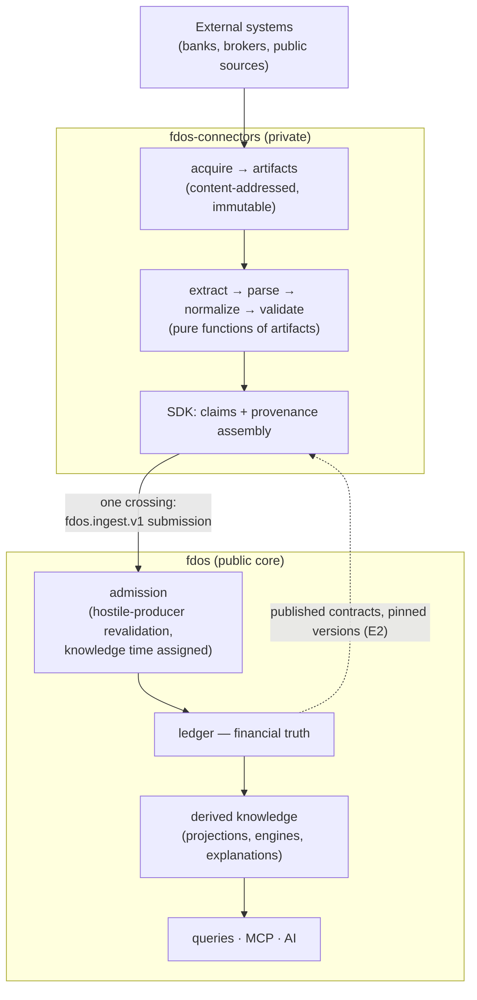
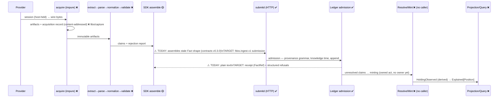
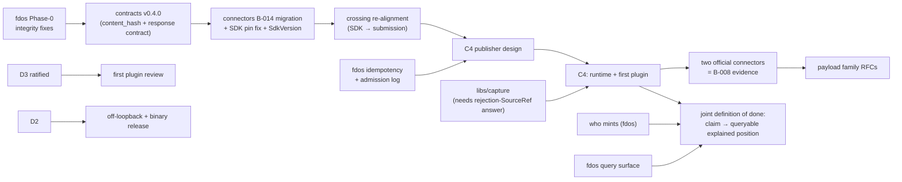

# Ecosystem architecture reconciliation

> **Status: provisional.** This document reconciles the two repositories'
> independently produced architecture reviews. It decides nothing. Per
> ADR-0000 and `AGENTS.md`, nothing here may be implemented against until the
> named RFC/ADR routes accept the relevant part — and every cross-repository
> item follows the Tier-0 procedure (RFC in `fdos`, ADR in both). Where this
> document conflicts with an accepted ADR in either repository, that ADR
> governs until superseded. Cross-repository citations are qualified
> (`fdos-connectors:ADR-0011`) per the ecosystem convention; unqualified
> ADR/RFC numbers are this repository's.

Evidence base: the 2026-08-07 fdos architectural audit (this directory and
its published findings report), the fdos-connectors C2 review dossier
(`docs/review/` in that repository, 13 documents, self-labelled "informative;
this review decides nothing"), both decision corpora in full (40 + 29 ADRs,
15 + 7 RFCs), and the vendored Tier-0 corpus at `ecosystem/v0.3.0`.

---

## 1. Executive summary

**The two architectures are already one architecture.** Both derive from the
same vendored Tier-0 corpus, and the independent reviews converged on the
same division: `fdos` decides what is true; `fdos-connectors` decides what
was observed. Across the entire evidence base there is no case of the
connector side attempting to own a financial concept — its own machinery
(closed `Capability` enum, payload registry holding only fdos-published
types, `Any` payloads whose names only fdos may publish) makes canonical
redefinition structurally inexpressible. The four boundary tests hold.

**The dominant risk is staleness, not divergence.** The connector side is
pinned to `libs/contracts v0.3.0` and its boundary vocabulary was fixed
before fdos built the entire ingest surface (the claim-submission shape of
ADR-0030, the admission service of ADR-0037). Its root decision — "what
crosses the boundary is a `fdos.ledger.v1.Fact` whose envelope the SDK
assembles" (fdos-connectors:ADR-0011, fdos-connectors:RFC-0003) — is now
contradicted by the upstream decision that a producer must never assemble an
envelope and submits a claim-submission message instead. Nothing is broken
today only because no connector exists and no byte has ever crossed.

**Three findings gate everything else:**

1. **The crossing type must be re-aligned before the first connector**
   (§14, contradiction C1). One superseding ADR downstream, one response
   contract upstream.
2. **The `content_hash` migration is in a two-sided deadlock of beliefs**
   (§14, contradiction C2): downstream has decided to migrate "the day
   `contracts v0.4.0` publishes — nothing else remains", while upstream has
   parked the rename indefinitely. One of the two repositories is wrong
   about a decided migration, and neither can see it from inside.
3. **The fdos Phase-0 integrity defects are upstream of every crossing**
   (audit findings; storage encodings, hash/seed injectivity, rounding
   semantics). They must close before the contract surface gains its next
   consumer-visible change, because they are unfixable once real facts —
   which only connectors will produce — persist.

Sections 15–16 list what must be decided and what stays explicitly open
(D1, D2, D3 remain open; none is silently resolved here). Section 20 gives
the one defensible migration order. An annex answers the ten gate questions.

---

## 2. Architectural invariants

The invariants both repositories already hold, restated as the frame every
reconciliation position below must preserve — E1–E9 in
[`../ecosystem/invariants.md`](../ecosystem/invariants.md), the
responsibility matrix and four boundary tests in
[`../ecosystem/boundary.md`](../ecosystem/boundary.md), and:

- **Truth flows one way.** External systems → connectors → canonical
  contracts → ledger → derived knowledge → surfaces. No layer writes
  downward. Contracts flow the other way exactly once: fdos defines,
  connectors consume at a pinned published version (E2).
- **A connector never corrects its provider.** Shape transformation is
  downstream work; meaning assignment is upstream work (§7).
- **A producer is hostile until admitted.** The ledger revalidates
  everything; nothing a published library did is trusted (ADR-0029 §2,
  carried by ADR-0037).
- **Evidence may flow upstream; code and schema may not.** The
  fdos-connectors:RFC-0008 pattern — describe the shape of the need, never
  the provider, and let fdos decide — is the sanctioned reverse channel,
  and the only one.

Two invariants this reconciliation **adds as proposals** (they generalise
findings from both reviews):

- **I-R1 — One crossing.** Exactly one wire shape carries data from the
  connector world into fdos: the ingest submission surface. Anything else
  that starts carrying facts (a shared file, a second message type, a
  side-channel) is a boundary violation even when convenient.
- **I-R2 — No competing vocabulary.** Any *closed* vocabulary that
  constrains the meaning of a canonical concept (schemes, capabilities'
  payload families, rejection kinds that reach the ledger) is defined in
  fdos, even when it is enforced downstream. A vocabulary that exists only
  downstream is a competing domain model in embryo (§5, §14-C5).

---

## 3. Repository responsibility matrix

Classification of every concept the mission names. "Both, split" rows state
the split precisely. Evidence: the Tier-0 matrix, the connectors review's
ownership rollup, and the fdos audit.

| Concept | Owner | The line, precisely |
|---|---|---|
| Financial facts | **fdos** | Only the ledger holds facts; a connector holds artifacts and emits claims. |
| Events (fact taxonomy: occurrences, observations, assertions) | **fdos** | The taxonomy, names, payload schemas and versions are canonical contracts. Connectors may not invent a payload type (enforced: registry + conformance prefix check). |
| Assertions (mints, merges, classifications) | **fdos** | Facts fdos itself concludes. A connector asserts nothing — it claims. |
| Securities / instruments | **fdos** | Identity (minting, resolution) and description (reference data — missing today, see the fdos Reference-context proposal). A connector sees only `{scheme, value}` claims. |
| Issuers / institutions (as domain entities) | **fdos** | Parties are canonical entities. Provider *identity as an acquisition source* enters fdos only as opaque provenance (`SourceRef`). |
| Institutions (as providers to integrate) | **fdos-connectors** | Provider-shaped, provider-lifetime; never named upstream (two-tier disclosure rule: official public sources may be named, private providers cross only as shapes). |
| Portfolio | **fdos** | A projection over facts. Nothing downstream may aggregate across providers (cross-provider dedup is "meaning"). |
| Transactions | **fdos** (semantics) / **fdos-connectors** (observation) | The payload family is an unpublished fdos contract (B-008 downstream). A connector observes transaction rows; fdos decides what a transaction *is*. |
| Market data | **fdos** (payloads, reference data) / **fdos-connectors** (acquisition) | No price payload exists; a market-data source "cannot emit prices at all yet" — an fdos debt. |
| Corporate actions | **fdos** | Domain rules, never provider quirks. Downstream capability exists only after fdos publishes the payload family. |
| Normalization | **fdos-connectors**, bounded | Shape only; the boundary is §7 and D3's ratification. |
| Extraction | **fdos-connectors** | Page structure and data conventions, pure functions over artifacts. |
| Browser sessions | **fdos-connectors** | Session *state and lifecycle* decided downstream (`libs/session`). The browser *runtime's provenance* is D1 — open (§9). |
| Authentication | **Split — D2 vs provider auth** | Provider credentials, MFA, session lifetime: fdos-connectors. Platform identity — who may write a stream, query, call MCP: **fdos**, undecided (D2, open). The word is never used unqualified across the boundary. |
| Connector state / checkpoints | **fdos-connectors** | Runtime state keyed by acquisition records — never plugin state, never SDK state, never visible to fdos. |
| Provenance | **Split — see §8** | Connectors produce acquisition provenance; fdos assigns knowledge time, seals the envelope, owns derivation provenance. |
| Publication | **fdos-connectors** (delivery) against **fdos** (admission contract) | The publisher's delivery semantics are C4 runtime work; idempotency and the receipt are fdos contract obligations (§11). |
| Validation | **Split by object** | Pipeline validation (claims + rejection report): connectors. Admissibility (provenance grammar, stream rules, envelope): fdos, at admission, on every write path. Neither trusts the other's. |
| Observability | **Each side its own; the contract is §10** | Correlation identifiers that cross are contract; telemetry never crosses. |
| Retry / scheduling / backoff / rate limits | **fdos-connectors** | Acquisition-side operational concern (Tier-0 matrix row). Retry *against admission* additionally requires fdos idempotency (§11). |
| Secrets / credentials | **fdos-connectors (host), exclusively** | No credential-shaped field exists in any fdos contract; keep that provable (§12). |
| Identity | **fdos, exclusively** | Minting is an owned fdos act (ADR-0033); a connector transmits identifier claims verbatim and can never mint, derive, or resolve. |

---

## 4. Dependency direction

Permitted reverse flows, exhaustively: published contract modules (pinned,
proxy-resolved); the vendored Tier-0 corpus and platform scripts (pinned);
evidence-shaped asks (issues, RFCs in fdos describing needs as shapes).
Forbidden reverse flows: any fdos import of connector code (E2 — proven
continuously by the absence of any such module in the graph), any fdos
knowledge of providers, protocols, sessions, or retries, and any fdos
dereference of a `SourceRef` (no resolver hook may ever exist — a hook
becomes a dependency the first time someone uses it).

---

## 5. Contract ownership

| Surface | Owner | Status |
|---|---|---|
| `fdos.kernel.v1`, `fdos.ledger.v1`, `fdos.ledger.payload.v1`, `fdos.ingest.v1` | **fdos** — canonical (defines/constrains the meaning of financial facts, ADR-0026) | Published; consumed at `v0.3.0` downstream (two minors stale) |
| `fdosconn.plugin.v1` + the six plugin interfaces | **fdos-connectors** — transport/authoring, carries but never declares canonical payloads (`Any`) | Published `v0.3.0`; sanctioned by ADR-0026 / D5 |
| Acquisition-record schema | **fdos-connectors** — deliberately *not* upstream schema (fdos-connectors:RFC-0008; adopting it upstream would be the reverse edge) | Specified, no code (`libs/capture` unbuilt) |
| Submission **response** (receipt, fact ref, structured errors) | **fdos** — missing entirely | The largest one-sided contract gap: the request is fully specified, the reply is unspecified plain text |
| Conformance/testkit assertion sets | **fdos-connectors** (plugin conformance) / **fdos** (contracts conformance kit, M12) | Both exist or are scheduled; neither tests the other's side |

**Where a connector-side abstraction could become a competing financial
model** — the mission's explicit question. Five places, in descending risk:

1. **The envelope-assembly vocabulary.** fdos-connectors:ADR-0011's
   field-ownership table has the SDK filling `kind`, `type`,
   `type_version`, `confidence`, `interpreter` on a `fdos.ledger.v1.Fact`.
   Under the current upstream contract those are admission-side decisions
   carried by the submission message — a producer that assembles a Fact is
   asserting envelope semantics it does not own. This is contradiction C1
   (§14) and the one live case of downstream machinery encoding upstream
   meaning. Fix: the SDK assembles a *submission*, and the field table's
   upper half moves behind the admission boundary.
2. **The scheme vocabulary.** The only closed identifier-scheme set in the
   ecosystem (`ticker`, `isin`, `cusip`, `figi`, `account_number`) lives in
   the SDK; upstream, schemes are open strings with governance recorded as
   an open item (ADR-0033 notes). The downstream set is currently the *de
   facto* canonical vocabulary — I-R2 violated in the benign direction.
   Fix: fdos owns the vocabulary (a governed registry in the contracts
   documentation); the SDK enforces it; the closed-set *mechanism* stays
   downstream, its *content* becomes upstream.
3. **`RejectionKind`.** A downstream taxonomy (`SHAPE_UNRECOGNISED`,
   `NO_EFFECTIVE_TIME`, `INVARIANT_VIOLATED`, `SESSION_EXPIRED`) that both
   sides expect to eventually reach the ledger ("a rejection is
   publishable"). The day it does, it constrains the meaning of a ledgered
   record and becomes canonical by I-R2 — decide the split before that day
   (§11, §15).
4. **The payload registry.** Correct today (holds only fdos-published
   types); the risk is a "temporary" local payload while B-008 is open.
   The downstream roadmap already prohibits this; the prohibition should be
   cited as an ecosystem invariant, not a local rule.
5. **`Observed`/`Holding` carrier types.** SDK-only, non-wire, correctly
   invisible upstream — but their field semantics (`Effective`,
   `PublishedAt`) restate kernel temporal semantics in prose. Keep them
   thin aliases over contract-documented semantics rather than a second
   description of time.

---

## 6. Versioning model

**Compatibility direction.** One-way, always: connectors (and, at the third
tier, institution plugin repositories) pin published fdos versions and
migrate forward; fdos never accommodates a downstream version. Within the
connector ecosystem the same rule repeats one tier down: plugins pin the
published SDK.

**The version ladder**, reconciled:

| Artifact | Versioned by | Compatibility promise |
|---|---|---|
| Canonical contracts (`libs/contracts`) | fdos, semver, package-level (ADR-0024) | Pre-1.0: none formal; E7 process for breaking changes. **Gap: no consumer-facing compatibility-policy document — downstream pins `v0.3.0` against an undocumented promise.** |
| Fact payloads | Per-type `type_version`, additive within a major, upcast-on-read (ADR-0011) | **Unimplemented upstream (no upcaster) — a downstream-visible risk**: the first payload major-version bump would strand every stored and in-flight claim. |
| `fdosconn` plugin contract | fdos-connectors, semver + `ContractRevision` compile-time pairing | The strongest mechanism in either repository; generalise it (below). |
| Connector SDK | fdos-connectors, semver; sealed-interface rules post-1.0 (fdos-connectors:ADR-0010) | Pre-1.0 no promise, stated. Unenforced by mechanism, by admission. |
| Plugin | Manifest `plugin@version`; is also the provenance `interpreter` | The version that pins replayability — one version covers all four pure stages, deliberately. |

**The v0.1.0/v0.3.0 mismatch**, resolved as policy: the SDK pinning
`plugin-api v0.1.0` while the testkit certifies revision 1 against `v0.3.0`
is benign by accident (byte-identical wire) and wrong by construction — the
authoring surface is the one consumer *not* compile-paired to the contract
revision it authors for. The reconciliation position: **every intra-ecosystem
consumer of a revisioned contract carries the compile-time pairing**
(`ContractRevision` = `CertifiesContractRevision` pattern), including the
SDK itself, and the missing `SdkVersion` constant ships before any plugin
exists to hardcode `"none"`. Both are downstream C2 debts, already
identified there; this document only adds: do them **before** the crossing
re-alignment (§20), so the migration lands on a coherent base.

**Breaking-change policy and deprecation.** E7 as written (RFC, dual
publish, N-1 window, consumer issue before merge), with two additions from
the audits: `reserved` field policy upstream (zero exist today; deletion
plus number reuse is currently undetectable), and **soak time** — no
contract element is consumed downstream in the milestone it is minted; the
`RoundingContext` case (wrong semantics reaching a pinned consumer having
never been exercised) is the standing evidence.

**Migration mechanics.** Downstream has the right model and it should be
named the ecosystem standard: enumerate the whole migration surface in the
blocked-work record before the tag exists (B-014's "two construction sites,
three go.mod pins, one constant — nothing else"), migrate the day the tag
publishes, decline the N-1 window while pre-1.0.

---

## 7. Normalization boundary

The line is already written (Tier-0, "Where normalisation stops") and the
downstream behaviour already conforms — the review found the position built
into types (opaque fragment bytes, verbatim identifier values, rejections
instead of corrections). What is missing is the ADR: **D3 must be ratified,
upstream, before the first plugin review** — otherwise every plugin review
re-litigates the line case by case.

Reconciled statement, for that ADR to adopt:

- **Shape (downstream, permitted):** charsets; timezone-explicit date
  parsing; locale decimal conversion with declared scale; table-to-rows;
  consistent field naming; layout discard; asserting emptiness
  (`empty_asserted`) rather than inferring it.
- **Meaning (upstream, forbidden downstream):** identity resolution
  (`PETR4` ≡ `petr4` is the resolver's decision); event classification
  (dividend vs return of capital); cost basis; netting; currency
  conversion; inferring a missing field from a business rule;
  cross-provider dedup; correcting a provider — ever.
- **The erosion watchpoint** both reviews independently flagged: locale
  conversion is where meaning-assignment will first be attempted (rounding,
  unit inference, currency assumption when a page omits the symbol). A
  plausible default is worse than an absence; every default in a `parse`
  layer is a boundary question.

**One fdos-side violation of its own line, found by the audit and armed by
this boundary:** the kernel's generic identity-seed fold case-uppercases
values of schemes that have no canonicalisation rule, silently merging
case-distinct `account_number` values — a *meaning* operation (a merge
performed, not recorded) executed inside fdos's own kernel, contradicting
the verbatim-values doctrine both repositories state. It is in the Phase-0
integrity list; this document adds the cross-repository reason it cannot
wait: connectors transmit values verbatim precisely so that fdos decides —
and today fdos "decides" by accident of `strings.ToUpper`.

---

## 8. Provenance ownership

The reconciled field-ownership table — one owner per field, no
duplication, no contradiction found once C1 is fixed:

| Provenance element | Producer | Where it is fixed |
|---|---|---|
| Source identity (`SourceRef` = algorithm-prefixed content hash of the acquisition record) | **Connector runtime** | Form specified by fdos (ADR-0028); referent, schema, storage, retention downstream; fdos never dereferences |
| `collected_at` | **Connector runtime** ("when the producer acquired it — FDOS acquires nothing"; corrected upstream on downstream's finding) | Submission message |
| Collector/parser version (`interpreter` = `plugin@version`, one per plugin, covering all four pure stages) | **Connector SDK**, from the manifest | Submission message; `unmediated` reserved for no-code producers |
| Confidence | **Connector SDK** — always `ASSERTED`; "a reading you are unsure of is a rejection, not a fact with a smaller number" | Adopt this downstream rule as the ecosystem-wide reading of ordinal confidence |
| Effective time | **Plugin**, from the source, never defaulted; no effective time is a rejection | Submission message |
| Checksum of artifacts | **Connectors** (SHA-256 over payload bytes; digest helper still owed downstream) | Acquisition record — never crosses |
| Knowledge time | **fdos ledger, exclusively**, at admission under the stream lock — absent from the submission by design, on both sides' agreement | Envelope, sealed at admission |
| Envelope assembly, fact ref | **fdos ledger** | Post-admission only (contradiction C1 resolves to this row) |
| Derivation records | **fdos**, content-addressed | The symmetric twin of acquisition records: fdos stores derivations because fdos derives; connectors store acquisitions because connectors acquire |
| Batch provenance | Settled: claims from one acquisition share one `SourceRef`; per-fact provenance with identical references, deduplicated by content addressing | Both sides aligned |

**One forward-looking constraint.** The fdos proposal package recommends
restructuring `Provenance` from a single interpreter to an interpreter
*chain* (OCR → parser → normaliser). Downstream has an accepted, reasoned
position that one `plugin@version` interpreter suffices because the four
pure stages ship as one versioned module. The reconciliation: a chain, if
adopted, must keep the single-plugin-version case as its degenerate form
and must not oblige connectors to version stages separately — their unit of
replayability is the plugin. This is a design constraint on an fdos RFC not
yet written, recorded here so it is not discovered after the fact.

---

## 9. Browser Runtime boundary — D1 stays open

**Not resolved here, explicitly.** The connectors briefing assumed browser
runtime ownership; the repository correctly records it as disputed (D1: no
ADR, milestone C5), and its own guidance names writing a browser
abstraction ahead of that decision as the most damaging available move.
This reconciliation preserves that: **D1 is open**, and nothing in either
proposal package presupposes an answer.

What is *already decided regardless of D1's answer*, and therefore firm
ground now:

- The port's obligations: typed non-credential input only; credential
  material never transits the port; profiles are operator property, never
  committed or deployed.
- **Detection evasion is out of scope by construction** — an evaluation
  criterion that materially narrows the option set: a vendored capability
  the repository is forbidden to use is a liability, not a feature.
- Profile encryption at rest is due before C5 *whatever* D1 decides — and
  the token-storage half moves earlier, to C4, with the first `HTTP_TOKEN`
  provider.
- The replaceability fitness test (swap the runtime for a stub; nothing
  changes) can be written before any runtime exists.

**Evidence required to decide D1** (the decision procedure, not the
decision): a build/vendor/consume-as-service comparison scored on — supply-
chain surface (a headless-browser tree is the largest either repository
would ever take; the pin/drift machinery extends to *vendor*, not to
*service*); the detection-evasion posture of each candidate and whether it
can be disabled; page-proxying feasibility across the future subprocess
transport (the hard case the isolation RFC left open); session-material
locality; and the disclosure constraint (the D1 RFC will be upstream-
visible, so it must be written in shapes, never provider names). Route:
RFC in fdos-connectors, ADR in both repositories. Due: before C5, and not
one commit of browser abstraction before it.

---

## 10. Observability boundary

Neither repository has observability; both reviews flag it; the connectors
review correctly makes it an RFC *preceding* the runtime RFCs. The
reconciliation defines only what crosses the boundary — each side owns its
own logs, metrics, and tracing entirely.

**Correlation identity — the contract is three identifiers:**

| Identifier | Minted by | Meaning across the boundary |
|---|---|---|
| `SourceRef` (acquisition content address) | Connectors | Joins every fdos-side fact to the acquisition that produced it — without fdos learning anything about the acquisition. Already crossing; already the natural join key. |
| Submission identity (idempotency key: the natural key over source + collected_at + effective + claims, or an explicit header) | Connectors, per the fdos response contract | Correlates a producer's retry storm with one admission decision. **Requires the response contract (§5) — does not exist.** |
| `FactRef` (stream + sequence) | fdos, at admission | The receipt; the identity every downstream question about an admitted fact uses from then on. Crosses only in the response. |

**Rules:** telemetry itself never crosses (a shared dashboard is a
disclosure surface — deciding *where telemetry may go* is part of each
side's RFC, and provider identity never appears in fdos-side telemetry —
`SourceRef` opacity extends to logs). Trace-context propagation across the
submission HTTP hop is deferred until the response contract exists; if
adopted it is W3C trace context on that one hop, nothing more. Audit
records exist on both sides and meet at `SourceRef`: the acquisition record
(connectors, specified, unbuilt) and the admission log (fdos, proposed in
the Ledger proposal — refusals recorded outside the ledger). The
connectors' rejection taxonomy is the native error telemetry on its side;
the fdos admission-refusal codes (to be defined in the response contract)
are the native error telemetry on the crossing.

---

## 11. Failure semantics

How each failure class propagates across the boundary — reconciled, with
today's gaps named:

| Failure | Where it lands | Reconciled semantics |
|---|---|---|
| Extraction / parse failure | Connectors | Rejection with reason (`RejectionReport` travels beside claims, never instead). Never silent; never fewer claims without a reason. Stays downstream unless rejections become publishable (below). |
| Normalization failure | Connectors | Same path. A value that cannot be normalised without meaning-assignment is a rejection, not a guess. |
| Pipeline validation failure | Connectors | Same path; `empty_asserted` distinguishes "empty account" from "login page". |
| Admission (validation) failure | fdos | Structured refusal in the response contract (missing today — refusals are unspecified text); recorded in the fdos admission log (proposed; today refusals vanish, which both sides' auditability principles condemn). Never a fact in the ledger. |
| Publication failure (transport error, timeout) | Connectors retry | **Currently unsafe**: admission has no idempotency, so at-least-once delivery writes permanent duplicates into an append-only ledger — the fdos audit's measured finding, and the connectors code's own comment predicts the resend. Gate: fdos natural-key dedup + receipt, before any real publisher. |
| Duplicate event | fdos dedup (natural key), connectors dedup keys (acquisition record digests) | Two independent layers, same key material; neither trusts the other. |
| Contract incompatibility | Fails loud at build (compile pairing, pin assertions) and at admission (structured `contract-version` refusal in the response contract) | Never negotiated silently at runtime. |
| Rejected fact / refused submission — is it recorded? | **Open, jointly** — the one failure-semantics question neither repository may answer alone | Downstream: "a rejection is publishable" (its charter). Upstream: rejections are errors, no payload, and the rejection-`SourceRef` question was explicitly left standing at D4's closure. Reconciliation recommendation: rejections become records in the fdos **admission log**, not facts in the ledger (attacker-controlled bytes stay out of the truth path; auditability is preserved), carrying a `SourceRef` under the same grammar. Route: joint RFC (§18). |

Also in scope here: the mapping from the downstream `RejectionKind`
taxonomy to lifecycle transitions (retry / await-session / fail) is
undecided downstream and stays downstream — it never crosses.

---

## 12. Security boundary

| Asset | Owner | Reconciled position |
|---|---|---|
| Provider credentials, MFA, session material | **Connectors host, exclusively** | Credential unreachability is the mechanism (no accessor, redaction under every verb, honest in-process ceiling recorded). **No credential-shaped field exists in any fdos contract; this must become a checked property** — a proto-surface check refusing fields named/typed like secrets is cheap and makes I-R1 tamper-evident. |
| Session/browser state | **Connectors** (state and lifecycle decided; runtime provenance is D1, open) | Profile encryption at rest: due C4 for tokens, C5 for profiles. |
| PII | **Both — and jointly unowned today** | Downstream has mechanisms (gitleaks rules for CPF/CNPJ/account numbers, fixture redaction manifests, two-tier disclosure). Upstream has *nothing* — zero PII/data-classification position — while holding account identifiers inside claims, seeds, and an append-only store where erasure conflicts with immutability by construction. The joint gap: one data-classification + erasure-tension decision, fdos-owned, before real personal data lands. |
| Financial data at rest | Split: artifacts (largest concentration of real data; retention open) downstream — facts (SQLite, no backup/DR story) upstream | Both named in the respective reviews; neither crosses. |
| Platform identity / authorization | **fdos — D2, open** | Deferred by eight upstream decisions; now gates: off-loopback ingestion, the query surface, MCP, and any binary release. The reconciliation adds: D2 also defines the *submission identity* of §10, so the response contract should be designed D2-compatible (scoped per stream/account) even while D2 is open. |
| Supply chain | Each side its own; three shared weak points | (1) Downstream's five published tags are mutable (no tag protection) — the one gap whose failure is artifact corruption, escalated correctly there; (2) upstream's release path escapes its own CGO pin and signs an incomplete manifest (audit findings); (3) pin freshness is watched for one pin of four. All three are cheap; none is architectural. |
| Secrets in contracts | **Prohibited, structurally** | No fdos message may ever carry credential material, and no connectors message may carry it past the host boundary (`Rejection.detail` never carries provider data — the same rule generalised). |

---

## 13. Cross-repository data flow

The end-to-end path, with build status per segment (✅ exists · 🟡 partial ·
❌ missing):

The two ⚠ marks are contradiction C1 and the response-contract gap — the
same crossing, both directions. Everything left of the crossing is
downstream milestone C2–C4 work; everything right of admission is the fdos
proposal package's Phase-1 ("the first answer"). **The joint definition of
done for the ecosystem's next phase: one claim, acquired from one official
public source, becomes one queryable, explained position — crossing the
target shapes.** That single sentence aligns fdos "M13" with connectors C4
and gives both roadmaps the same exit criterion.

---

## 14. Contradictions found

- **C1 — The crossing type.** fdos-connectors:ADR-0011 /
  fdos-connectors:RFC-0003 ("the root of the set"): what crosses is a
  `fdos.ledger.v1.Fact` whose envelope the SDK assembles. fdos ADR-0030 /
  ADR-0037: a producer submits `fdos.ingest.v1.HoldingClaimSubmission`,
  differs from a Fact "by exactly the field a producer must not set", and
  the envelope exists only after admission. Decided independently, in that
  order, on opposite sides of the same line; the downstream decision
  predates the upstream surface and is now wrong. Resolution: downstream
  supersedes (SDK assembles the submission); upstream owes the response
  contract that makes the new crossing usable (§5). Neither review saw
  this — each was inside one repository.
- **C2 — The `content_hash` migration.** Downstream
  (fdos-connectors:ADR-0028, B-014): adopted including the rename,
  "migrate the day `contracts v0.4.0` publishes… nothing else remains."
  Upstream: ADR-0028 records the rename as decided, the proto still
  carries `value`, and the roadmap parks the rename against a future major
  package version. Two repositories hold incompatible beliefs about the
  *schedule* of a jointly decided change; downstream waits on a tag
  upstream does not plan to cut. Resolution required jointly: either cut
  the tag with the rename (recommended — pre-1.0, one consumer, migration
  surface already enumerated to six lines) or explicitly re-decide the
  parking in both logs. The silent version is the only wrong version.
- **C3 — Rejection publishability.** Downstream charter: "a rejection is
  itself publishable; a failed acquisition is information the ledger
  benefits from." Upstream: no rejection payload, refusals are Go errors,
  and the question "does a rejection carry a `SourceRef`" was left
  standing at D4's closure on both sides. Not yet a defect — becomes one
  the day a connector publishes. §11 records the recommended shape
  (admission log, not ledger facts) and the joint route.
- **C4 — `collected_at` semantics.** Was a contradiction (upstream doc:
  "when FDOS fetched it"; FDOS fetches nothing); raised downstream as a
  finding, corrected upstream in the submission contract ("when the
  producer acquired it — FDOS acquires nothing"). **Reconciled; recorded
  as the model of the evidence-upstream channel working.**
- **C5 — Scheme vocabulary and the word "canonicalisation".** Downstream
  ADR title: "the SDK owns scheme canonicalisation" (= closed *scheme-name*
  set; values pass verbatim). Upstream ADR-0033: "canonicalisation is per
  scheme" (= *value* folding, inside fdos, only for schemes with issuing
  standards). Same word, two operations — compatible in substance,
  colliding in vocabulary, with the actual scheme *vocabulary* governed
  nowhere upstream (I-R2). And one real semantic conflict hides under it:
  the upstream kernel's generic seed fold uppercases values the downstream
  side deliberately transmits verbatim (§7). Resolution: fdos governs the
  vocabulary; the fold fix is Phase-0; the two ADR vocabularies get
  disambiguated in the D3/vocabulary ADR ("scheme vocabulary" vs "value
  canonicalisation").
- **C6 — Minor factual drift, both sides.** Downstream: SDK pin drift
  (v0.1.0/v0.3.0), five stale-prose defects, "three modules" vs five
  tags, stale corpus-pin claims in two docs. Upstream: `.context/` 4–35
  ADRs stale, README five milestones behind, a dangling "Domain Vision",
  an enforcement claim (`depguard`) that never existed. Same failure
  class both sides name themselves: checks verify that names resolve, not
  that statements are true.

---

## 15. Decisions required (blocking, in dependency order)

| # | Decision | Owner / route | Blocks |
|---|---|---|---|
| 1 | Phase-0 integrity fixes (encodings, seed/hash injectivity, rounding, store comparisons) | fdos | Everything that persists or crosses |
| 2 | The crossing re-alignment: SDK assembles a submission (supersession downstream) + the submission **response contract** (upstream) | fdos-connectors ADR + fdos RFC→ADR | First publisher, C4, idempotent retry, correlation identity |
| 3 | Admission idempotency by natural key + the admission log (refusals recorded) | fdos RFC→ADR | Safe at-least-once publication; C3 rejection question |
| 4 | `contracts v0.4.0` schedule — cut with `content_hash` or re-decide the parking, in both logs | Joint (E7 process) | B-014; unblocks downstream's decided migration |
| 5 | D3 ratified — where normalisation stops | fdos ADR, adopted in both | First plugin review |
| 6 | Scheme-vocabulary governance (fdos-owned registry; SDK enforces) | fdos RFC→ADR, downstream adoption | Payload families; resolver correctness |
| 7 | D2 — platform identity and stream authorization | fdos RFC→ADR | Off-loopback ingestion, query surface, MCP, any binary release |
| 8 | Who mints, on whose authority (the unmet M9 objective) | fdos | Claims → positions; visible value for every connector |
| 9 | Payload families (transactions first), evidence-led after two official connectors | fdos RFC per family | B-008; connectors beyond positions-quantity-only |
| 10 | Batch knowledge time (the hybrid-clock question) | fdos RFC | Any batch submission endpoint; statement-shaped acquisition |

## 16. Decisions explicitly deferred (open, and correctly so)

- **D1 — browser runtime provenance.** Open until the §9 evidence exists;
  RFC downstream, ADR both; before C5. Nothing here presupposes it.
- **Subprocess transport.** Trigger already fixed (first plugin not
  written by the first party); not before.
- **Incremental sync / checkpoint shape.** Runtime state, C4 RFC set;
  explicitly never an SDK abstraction.
- **Trace-context propagation on the crossing.** After the response
  contract exists; "not yet" is acceptable, defaulted is not.
- **SourceRef algorithm agility.** Deferred; the algorithm prefix keeps it
  answerable.
- **Graph storage, statistical risk, Credit Intelligence, Python
  toolchain.** Deferred/cut per the fdos proposal package and downstream
  roadmap respectively; unchanged here.

## 17. Proposed ADRs (titles only — nothing is created by this document)

**fdos:** platform identity and stream authorization (decides D2) · the
submission response contract · admission idempotency by natural key · the
admission log: refusals are recorded, outside the ledger · where
normalisation stops (ratifies D3, disambiguates the two canonicalisation
vocabularies) · scheme vocabulary is governed upstream and enforced
downstream · the `contracts v0.4.0` schedule (or the explicit joint
re-parking of the rename).

**fdos-connectors:** the SDK assembles a submission, not a fact (supersedes
its boundary-type ADR's assembly half) · the SDK is compile-paired to the
contract revision it authors for (fixes the pin drift, adds `SdkVersion`) ·
adoption ADRs mirroring D2, D3, and the vocabulary decision, per Tier-0.

## 18. Proposed RFCs

**fdos:** the query surface · reference data · the transactions payload
family (then statements, corporate actions, instrument reference —
evidence-led) · batch knowledge time · rejection records at admission
(**joint** — co-drafted with fdos-connectors, per C3).

**fdos-connectors:** the runtime set (host/loader; scheduling and failure;
artifact persistence and publication — now targeting the response
contract; checkpointing) · observability (before or with the runtime set,
never after) · D1 (browser runtime provenance, written in shapes).

## 19. Implementation dependencies

Two loops worth naming: payload families need connector evidence, and
connectors need payload families to be worth running — broken by shipping
the first two connectors against `positions` alone, deliberately narrow.
And the rejection-`SourceRef` answer must precede `libs/capture`, because
capture fixes the acquisition-record shape that rejections would share.

## 20. Migration ordering

1. **fdos Phase-0** (encodings, injectivity, traps, store comparisons,
   stream validation, idempotency groundwork). Nothing crosses before this.
2. **fdos cuts `contracts v0.4.0`**: `content_hash` rename + the submission
   response messages, one coordinated minor, consumer issue per E7.
3. **Connectors C2 debts + B-014 the same day**: migration (enumerated, ~6
   lines), SDK pin to the certified revision, `SdkVersion`, identity-guard
   tests, denylist fixtures.
4. **Crossing re-alignment**: downstream supersession ADR (SDK assembles
   the submission); admission log + idempotency land upstream; the field-
   ownership table is re-stated in the superseding ADR with the envelope
   half behind admission.
5. **D3 ADR** upstream, adopted downstream. **Vocabulary ADR** with it.
6. **`libs/capture`** (after the joint rejection-records RFC settles
   whether rejections share the acquisition-record grammar), then the
   runtime + observability RFC sets, then C4.
7. **D2**, then off-loopback operation and (only then) any signed binary
   release, per the standing gate both audit packages agree on.
8. **First two official connectors → payload-family RFCs → the joint
   definition of done** (§13): one claim from one public source becomes one
   queryable, explained position.

---

## Annex — the final gate, answered

1. **What does FDOS own?** Financial truth: the canonical model, fact
   taxonomy, identity minting/resolution, admission, the ledger, derived
   knowledge, all canonical contracts, platform identity (D2), the
   normalisation *meaning* line, scheme vocabulary (proposed, I-R2).
2. **What does fdos-connectors own?** Observation: acquisition, artifacts
   and their store/retention, the pure pipeline, shape normalisation,
   plugin contract and SDK (`fdosconn.*`), sessions/credentials/profiles,
   scheduling/retries/rate limits, connector state and checkpoints,
   acquisition provenance and the acquisition-record schema, its own
   observability.
3. **What crosses the boundary?** Exactly one data shape (the ingest
   submission; today mis-targeted — contradiction C1), its response
   (missing), three correlation identifiers (`SourceRef`, submission
   identity, `FactRef`), pinned published contracts downstream, vendored
   governance downstream, and evidence-shaped asks upstream. Nothing else.
4. **Who owns each contract?** Canonical (`fdos.*`): fdos. Plugin/transport
   (`fdosconn.*`): fdos-connectors (sanctioned by ADR-0026). Acquisition-
   record schema: fdos-connectors, deliberately not upstream schema. The
   response contract: fdos, once it exists.
5. **Who owns provenance?** Split per the §8 table: acquisition provenance
   (source, collected_at, interpreter, confidence, effective) downstream;
   knowledge time, envelope, refs and derivation provenance upstream; no
   field has two owners.
6. **Who owns validation?** Pipeline validation downstream; admissibility
   upstream; both run, neither trusts the other.
7. **Who owns financial truth?** fdos, exclusively; downstream's own
   machinery makes the alternative inexpressible.
8. **Who owns browser/session state?** Session state and credentials:
   fdos-connectors, decided and built. The browser *runtime's provenance*:
   open (D1) — explicitly not answered here. **This is the one gate
   question with a deliberately incomplete answer, and it is reported as
   such, with the evidence procedure in §9.**
9. **How are versions synchronized?** One direction (§6): downstream pins
   published upstream versions with compile-time pairing (to be extended to
   the SDK), migrates by enumerated surface on tag publication, no
   N-1 while pre-1.0; upstream owes the compatibility-policy document and
   the v0.4.0 schedule decision (contradiction C2).
10. **How does a connector publish a fact without knowing financial
    business rules?** It doesn't publish a fact — it publishes a *claim
    submission*: verbatim identifier claims, a quantity, an effective
    interval, and acquisition provenance. Everything that makes it a fact —
    knowledge time, envelope, identity, admission, projection — happens
    upstream, behind a boundary the connector cannot reach. That is the
    architecture, and after C1's fix it is also the wire.
